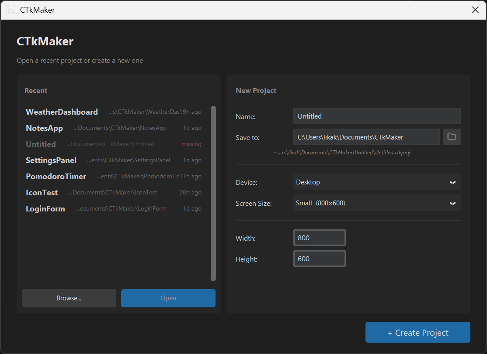

# CTkMaker

Drag-and-drop visual designer for **[CustomTkinter](https://github.com/TomSchimansky/CustomTkinter)** — design Python GUIs without writing layout code by hand.

**Community Hub:** [kandelucky.github.io/ctkmaker-hub](https://kandelucky.github.io/ctkmaker-hub/) — browse and share reusable components built in CTkMaker.

> **v1.10.2** — **Horizontal / Vertical layouts flex-shrink** their children to a content-min floor instead of clipping the latest one off the edge. Three `Stretch` semantics: **fixed** (user controls W and H), **fill** (user controls main axis, cross auto-fills), **grow** (main axis auto-distributed `avail / N` floored at text + icon + chrome padding, cross auto-fills). Properties → Geometry editors enable / grey out per Stretch. Rebalance fires on add / remove / layout swap / stretch change, on a sibling or container width-edit, and at runtime via a `<Configure>` bind so the exported `.py` mirrors the canvas. Once even floor × N exceeds the container, overflow clips silently — no scrollbar, by design.
>
> Earlier in v1.10: **Card image padding** scales to Card geometry + allows negative values for outside-the-card overhangs (v1.10.2). **Generated `.py` is ~21% smaller** — exporter skips kwargs that match both Maker's and CTk's defaults (v1.10.0); inlines the `CircleButton` subclass only when at least one button needs it (v1.10.1).
>
> **Major additions since v1.3.0:** **Phase 2 visual scripting** (v1.6.0+) — pick any event-firing widget on the canvas, the Properties panel grows a Unity-style **Events** group with per-method action rows; each window owns a behavior class in `<project>/assets/scripts/<page>/<window>.py` that the exporter wires up automatically. **Phase 3 Behavior Fields** (v1.8.0+) — declare typed slots `target_label: ref[CTkLabel]` on the behavior class and the Inspector grows a `[Pick…]` button per slot for assigning canvas widgets. **CircularProgress widget** (v1.9.0+). **Publish-to-Community** flow with MIT license gate (v1.4.0+) + Window components + the [Community Hub site](https://kandelucky.github.io/ctkmaker-hub/) (v1.5.0+).
>
> ⚠️ **Tested on Windows only.** macOS and Linux are not verified — see [issue #5](https://github.com/kandelucky/ctk_maker/issues/5) for the running list of known incompatibilities + how to help.

[](docs/screenshots/canvas.png)

## Project structure

A CTkMaker project is organised in four levels:

- **Project** — a folder containing one or more page files plus a shared asset pool
- **Page** — a single `.ctkproj` design (Login, Dashboard, Settings, ...) — pages share the project's fonts / images / icons
- **Window** — a Tk window inside a page; either the **Main Window** (one per page) or a **Dialog Window** (zero or more)
- **Widget** — buttons, labels, frames, etc. nested inside a window

## What it does

- **Visual canvas** — real CTk widgets on a zoomable workspace. What you see is what you get. Multiple windows (main + dialogs) live on the same canvas in one page.
- **Widgets — 21 in the palette:** Button, Segmented Button, Label, Image, Card, Progress Bar, Circular Progress, Check Box, Radio Button, Switch, Entry, Textbox, Combo Box, Option Menu, Slider, Frame, Scrollable Frame, Tab View, Vertical Layout, Horizontal Layout, Grid Layout. Richer property editing than raw CTk: drag-scrub numbers, paired font family + size, multiline overlays, segmented value editor, scrollable dropdown for ComboBox / OptionMenu, color swatches with eyedropper. Open **Tools → Inspect CTk Widget** to see every property side-by-side — native CTk parameters vs builder-added helpers.
- **Variables + property bindings (two-level)** — declare shared values once and bind them to widget properties from the Properties panel with one click. **Global** variables (blue) live on the project; **Local** variables (orange) live on a single window and stay invisible to widgets in other windows. Updates propagate live across every bound widget. Reparenting or pasting a widget across windows triggers a migration dialog so local bindings are preserved cleanly. Exported code keeps globals on the main window and locals on each class — no glue code to wire up.
- **Component library** — save any selection on the canvas as a reusable component (`.ctkcomp` zip), browse them in the Palette's Components tab, then drag back onto any canvas to instantiate with fresh UUIDs. Real-time search filter, single-widget components show their type icon, multi-widget fragments fall back to a generic icon. Lives under `<project>/components/` so the library travels with the project. Variable bindings inside a component get bundled with the file — on insert, name conflicts surface a Rename / Skip dialog. Whole windows can be saved too (drop spawns a fresh Toplevel). Sharing goes through the [Community Hub](https://kandelucky.github.io/ctkmaker-hub/) via a Publish flow gated by MIT license + form (Author / Category / Description).
- **Visual scripting (event handlers + behavior fields)** — clickable widgets gain an **Events** group in the Properties panel: bind one or more methods to a widget event and the exporter generates the stubs in a per-window behavior file inside the project folder. Behavior classes can declare typed widget slots that surface in the Inspector for one-click assignment, so handler code can reach any canvas widget by name without manual lookup. Editor preference (Settings → Editor) routes `Open in editor` / F7 / double-click into VS Code, Notepad++, or IDLE.
- **Widget descriptions (AI bridge)** — every widget has a free-form description field for plain-language intent ("when clicked, add the digit 1 to the display"). Export optionally emits descriptions as Python comments above each widget — paste the file into your favourite AI to have it fill in the missing logic.
- **Layout managers** — `place`, `vbox`, `hbox`, `grid` rendered with the actual Tk pack/grid managers. Drop into cells, drag to reparent, even across windows. Horizontal / Vertical containers flex-shrink their children to a content-min floor (CSS-flex semantics): `fixed` siblings keep their nominal size, `fill` siblings let the user pin the main axis while the cross axis auto-fills, `grow` siblings auto-distribute the remaining space and shrink down to text + icon + chrome padding before clipping.
- **Alignment & distribution** — toolbar buttons to align widgets (Left / Center / Right + Top / Middle / Bottom) and distribute them evenly. Auto-detects intent: a single widget aligns to its container, multiple widgets align to each other.
- **Marquee selection + smart snap guides** — drag a rectangle on empty canvas to multi-select; while dragging a widget, cyan guide lines snap its edges / centre to siblings and to the container. Hold Alt to bypass.
- **Groups** — Ctrl+G binds a same-parent selection together; clicking any member targets the whole group, fast follow-up drills to a single member, drag always carries the group as one. Object Tree shows them as a virtual `◆ Group (n)` parent with members nested in soft orange. Ctrl+Shift+G dissolves the group.
- **Asset system** — fonts, images, and 1700+ Lucide icons managed inside the project folder. Tinted PNGs, system-font auto-import, portable references.
- **Live preview** — run any window as a real CTk app in one click; floating **Screenshot · F12** button saves the client area as PNG to share.
- **Clean code export** — one runnable Python file per window. Optional `.zip` bundle (Python code + assets) for sharing. Per-page export ships only the assets that page actually references.

## Screenshots

[](docs/screenshots/startup.png)

*Startup — recent projects on the left, new-project form on the right with device + screen-size presets.*

## Quick start

```bash
git clone https://github.com/kandelucky/ctk_maker.git
cd ctk_maker
pip install -r requirements.txt
python main.py
```

## Documentation

Full docs live in the [Wiki](https://github.com/kandelucky/ctk_maker/wiki):

- [User Guide](https://github.com/kandelucky/ctk_maker/wiki/User-Guide) — workflow walkthrough
- [Widgets](https://github.com/kandelucky/ctk_maker/wiki/Widgets) — every supported widget + properties
- [Keyboard Shortcuts](https://github.com/kandelucky/ctk_maker/wiki/Keyboard-Shortcuts) — full reference
- [Version history](docs/history/) — screenshots and notes from each release

## Community Hub

[**kandelucky.github.io/ctkmaker-hub**](https://kandelucky.github.io/ctkmaker-hub/) is the
community library where reusable components built in CTkMaker get shared. Browse cards
by category (forms, buttons, mini-apps, …), click to preview, download the `.ctkcomp.zip`,
drop it into your own project.

To share one of your own — click **Publish to Community** in the builder, sign the MIT
agreement, post the file in the [Components Discussion](https://github.com/kandelucky/ctk_maker/discussions/new?category=components).
A sync workflow picks it up within ~30 minutes and your card appears on the site.

## Reporting issues

Found a bug or have an idea? Use **Help → Report a Bug** (or the toolbar button on the right) — a guided form opens that submits straight to the GitHub issue tracker, or saves a markdown file you can email instead. You can also [open an issue directly](https://github.com/kandelucky/ctk_maker/issues).

## Tech stack

- **Python 3.12+** (tested on 3.14)
- **CustomTkinter** 5.2.2+
- **Pillow**, **tkextrafont**, **ctk-tint-color-picker**

## What's next

- Custom user widgets + plugin system
- Distribution: PyInstaller bundles, installers, auto-updater
- macOS / Linux verification + cross-platform polish
- Component Hub growth — categories, search, version history

## Support

If CTkMaker helps you, [buy me a coffee ☕](https://buymeacoffee.com/Kandelucky_dev).

## License

MIT
