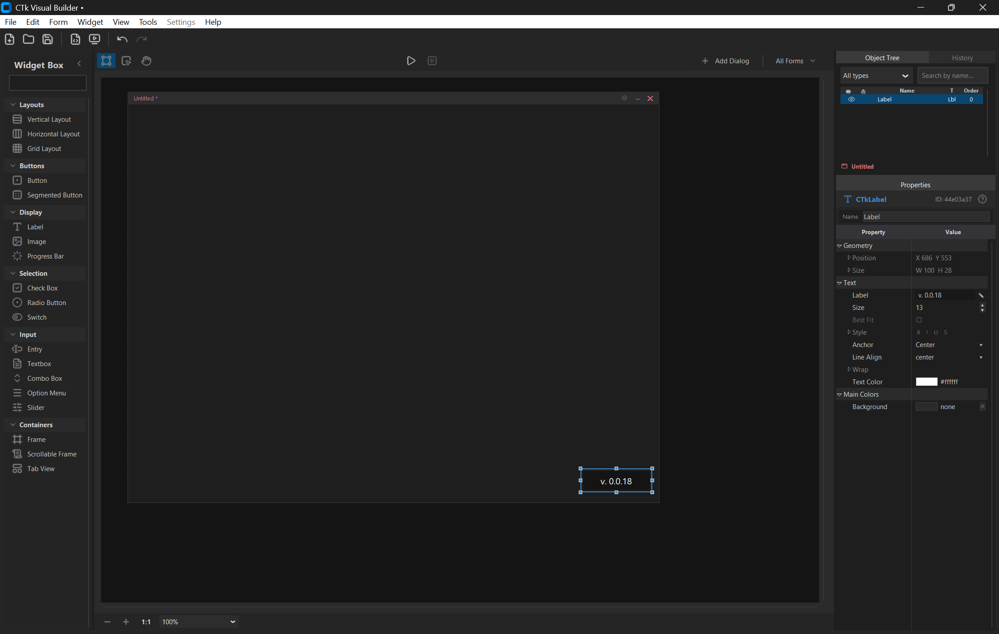

# CTkMaker

Drag-and-drop visual designer for **CustomTkinter** — design Python GUIs without writing layout code by hand.

> **v1.0.0** — first stable release. Free and open source.
>
> ⚠️ **Tested on Windows only.** macOS and Linux are not verified for this release — feedback and contributions welcome.

[](docs/history/v0.0.18.png)

## What it does

- **Visual canvas** — real CTk widgets on a zoomable workspace. What you see is what you get. Multi-document: main window + dialogs in one project.
- **Widgets** — all 19 CustomTkinter widgets (Button, Entry, Slider, Switch, ProgressBar, Frame, ScrollableFrame, Tabview, Image, ComboBox, OptionMenu, …) with richer property editing than raw CTk: drag-scrub numbers, paired font family + size, multiline text overlays, segmented value editor, scrollable dropdown for ComboBox / OptionMenu, color swatches with eyedropper. Open **Tools → Inspect CTk Widget** to see every property side-by-side — native CTk parameters vs builder-added helpers.
- **Layout managers** — `place`, `vbox`, `hbox`, `grid` rendered with the actual Tk pack/grid managers. Drop into cells, drag to reparent, even across documents.
- **Asset system** — fonts, images, and 1700+ Lucide icons managed inside the project folder. Tinted PNGs, system-font auto-import, portable references.
- **Clean code export** — one runnable Python file per project. Optional `.zip` bundle (Python code + assets) for sharing.

## Screenshots

<!-- screenshot: canvas + properties panel + object tree -->
<!-- screenshot: Lucide icon picker with tint -->
<!-- screenshot: Preferences dialog -->

## Quick start

```bash
git clone https://github.com/kandelucky/ctk_maker.git
cd ctk_maker
pip install -r requirements.txt
python main.py
```

## Documentation

Full docs live in the [Wiki](https://github.com/kandelucky/ctk_maker/wiki):

- [User Guide](https://github.com/kandelucky/ctk_maker/wiki/User-Guide) — workflow walkthrough
- [Widgets](https://github.com/kandelucky/ctk_maker/wiki/Widgets) — every supported widget + properties
- [Keyboard Shortcuts](https://github.com/kandelucky/ctk_maker/wiki/Keyboard-Shortcuts) — full reference

## Tech stack

- **Python 3.12+** (tested on 3.14)
- **CustomTkinter** 5.2.2+
- **Pillow**, **tkextrafont**, **ctk-tint-color-picker**

## What's next

- Alignment tools, marquee selection, snap-to-guides
- Variables panel + event handlers
- Custom user widgets + plugin system
- Distribution: PyInstaller bundles, installers, auto-updater

## Support

If CTkMaker helps you, [buy me a coffee ☕](https://buymeacoffee.com/Kandelucky_dev).

## License

MIT
