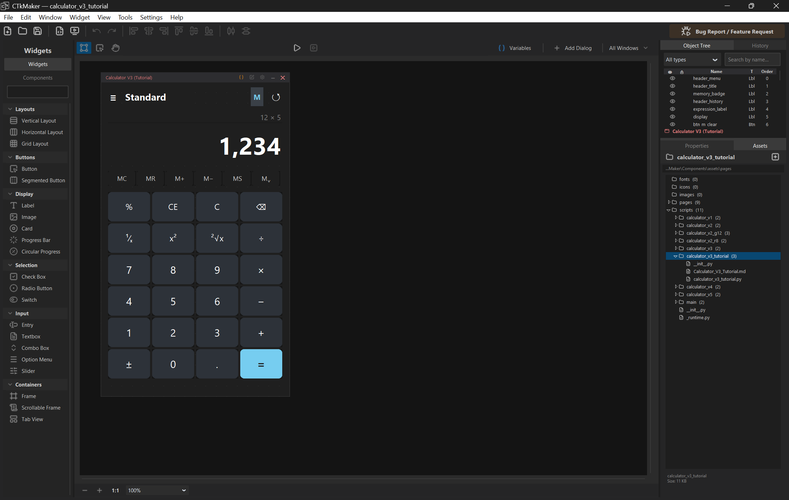

# Version history

Visual snapshots of CTkMaker across releases. Screenshots only on the milestones that introduced something visibly new.

| Version | Screenshot | Highlights |
|---------|-----------|------------|
| **v1.10.2** | _no screenshot_ | **Card image padding goes negative + scales to Card size.** Pre-1.10.2 the Card widget's image-padding sliders (Properties → Image → Padding X/Y) were locked to `[0, 200]` — couldn't pull an image past the edge for an outside-the-card overhang effect, and the upper bound was meaningless on a 4000×4000 Card or claustrophobic on a 30×30 one. Default also dropped a fresh image 8px in from the anchor edge. v1.10.2 changes the defaults to `0` (image lands flush on the chosen anchor) and replaces the fixed range with `[-width, width]` for X and `[-height, height]` for Y — slider bounds now follow Card geometry. Negative values push the image outside the card relative to its anchor. Existing `.ctkproj` projects keep their stored padding values; only freshly dropped Cards see the new default. |
| **v1.10.1** | _no screenshot_ | **Exported `.py` skips the `CircleButton` subclass when no button needs it.** v1.10.0 left every CTkButton routed through the inlined `CircleButton` class (the v1.9.10 layout patch for full-radius + text), even on projects whose buttons used the default `corner_radius=6`. The exporter now gates per-button on `2 * corner_radius >= min(width, height)` — pill / circle geometry still emits `CircleButton(...)`, regular geometry emits plain `ctk.CTkButton(...)`, and the 15-line subclass definition only inlines when at least one button actually needs it. Live workspace canvas is unchanged (still always uses `CircleButton` so resizing into pill geometry is safe mid-edit). |
| **v1.10.0** | _no screenshot_ | **Exporter omits redundant default kwargs — generated `.py` files shrink ~21%.** Pre-1.10.0 the exporter wrote every key from `node.properties`, which is a full copy of `descriptor.default_properties` populated at widget-add time. A 130-widget Showcase project produced 2911 lines vs 165 for an equivalent hand-written CTk script. v1.10.0 adds an `inspect.signature`-built catalog of CTk's constructor defaults; `_emit_widget` now skips a kwarg only when the value matches **both** Maker's descriptor default AND CTk's constructor default — so `CTkButton.height=32` (Maker) ≠ 28 (CTk) still emits, but `hover=True` / `state="normal"` / `compound="left"` / `anchor="center"` drop out. Per-widget `ctk.CTkFont(size=13, weight="normal", slant="roman")` instances also collapse when every font knob is at default — Showcase went from 124 to 8 CTkFont instances. Quality + size win; runtime perf neutral (cold startup + scaling-toggle within measurement noise). |
| **v1.9.16** | _no screenshot_ | **Identifier-safe widget Names by default + ScrollableFrame spacing now editable.** Newly dropped widgets get Properties-panel `Name` defaults that are already valid Python identifiers (`button_1`, `checkbox_1`, `vertical_layout_1`) instead of display labels (`Button (1)`, `Check Box`, `Vertical Layout`) — the export-time "Widget name fallbacks" dialog no longer fires for fresh drops. Existing `.ctkproj` projects keep their stored names; only freshly created widgets follow the new format. CTkScrollableFrame's Properties panel grows a Layout group with `Spacing` — previously the value was set in `default_properties` but had no row, so children-spacing was only editable by hand-editing the `.ctkproj` JSON. Side-fix: scrollable dropdown's `_on_root_click` now wraps its first `state()` probe in the same `tk.TclError` guard `_on_root_configure` got in v1.9.12 — preview-teardown click race no longer prints a phantom traceback. |
| **v1.9.15** | _no screenshot_ | **Host crashes show traceback inline + log file.** Pre-1.9.15 the "Open failed" / "Recover failed" dialogs said _"Unexpected error — see console"_, but shortcut launches (`pythonw.exe`) have no console — the dialog was a dead end. v1.9.15 routes every swallowed exception through `log_error()` which now appends to `%TEMP%/ctkmaker_crash.log` and returns the formatted traceback. A new modal `app/ui/crash_dialog.py` shows the traceback in a scrollable read-only Text widget with **Copy traceback** + **Open log file** + **Close** buttons. Global `sys.excepthook` + `Tk.report_callback_exception` are installed in `main.py` so any uncaught exception (startup or inside the Tk loop) gets the same dialog instead of vanishing into detached stderr. |
| **v1.9.12** | _no screenshot_ | **Settings → Preview tab — toggle preview tools + console.** New checkboxes for "Show preview tools" (orange ring + Save/Copy buttons + title prefix) and "Show preview console" (Windows console window). Both default on, so existing flow is unchanged; turning either off lets experienced users get a clean F5 → bare window. When console is off, the runner is bypassed and the preview is spawned with `CREATE_NO_WINDOW`. Side-fix: `PYTHONIOENCODING=utf-8` is forced on every preview subprocess so non-ASCII characters in injected `print()` calls don't crash silently when stdout falls back to cp1252. |
| **v1.9.11** | _no screenshot_ | **Preview window redesign + console-on-shortcut fix.** F5 preview now ships an orange edge ring + "🟠 PREVIEW —" title prefix so the preview window is unmistakable; the floating screenshot button splits into **Save (F12 → PNG file)** and **Copy (F11 → Windows clipboard)** with toast feedback after each action; both buttons are draggable to any spot on screen. Bug fix: shortcut launches (target = `pythonw.exe`) made `sys.executable` windowless, so `CREATE_NEW_CONSOLE` opened nothing — `_preview_python_executable()` swaps to the sibling `python.exe` so behavior `print()` and tracebacks reach the user. |
| **v1.9.10** |  | **Full-circle CTkButton with text renders cleanly.** Upstream `CTkButton._create_grid` reserves corner-radius worth of space on outer columns; at full radius (radius == w/2) text gets 0 width and the outer Frame grows past its size, overlapping neighbours. New `app/widgets/runtime/circle_button.py` ships `CircleButton`, a subclass that temporarily zeros `_corner_radius` for `_create_grid` only — visual rounded shape unchanged. Calculator-style 60×60 + radius=30 + text now renders cleanly in workspace, preview, and exported `.py`. |
| **v1.9.9** | _no screenshot_ | **Filtered exports ship the per-window behavior subtree.** Pre-1.9.9 export paths with an `asset_filter` (Quick Export, per-page batch) emitted `from assets.scripts...` against an `assets/` folder that didn't include the scripts subtree — `collect_used_assets` only walks image/font tokens. Result: `ModuleNotFoundError: No module named 'assets'` at first run. v1.9.9 copies the package chain + `_runtime.py` + per-page subfolder during filtered exports. |
| **v1.9.8** | _no screenshot_ | **Exporter threads user-set widget Names through to exported attribute names.** Pre-1.9.8 the Properties panel "Name" field was decorative — every widget got `<type>_<N>` regardless. Phase 2 behavior calling `self.window.submit_btn` crashed with AttributeError. v1.9.8 unifies live emit + Behavior Field replay behind one resolver that consults `node.name` first, validates against keywords + reserved CTk method names, and falls back to the legacy counter on conflict. |
| **v1.9.7** | _no screenshot_ | **`.py` opens in configured editor + starter template caught up.** Double-clicking a `.py` row in the Assets panel now routes through the Settings → Editor preference (was bypassing via `os.startfile`). Starter template no longer claims a "behavior layer" is on the roadmap — Phase 2/3 already shipped; replaced with a pointer to `assets/scripts/<page>/<window>.py`. |
| **v1.9.6** | _no screenshot_ | **Canvas regression fix — Entry textvariable clobber.** When `CTkEntry.initial_value` is bound to a Local Variable, the descriptor's `apply_state` was calling `widget.delete(0, "end")` — Tk's bidirectional textvariable sync propagated the delete and cleared the variable for every other widget bound to it. v1.9.6 detects the bound state at the top of `apply_state` and short-circuits. |
| **v1.9.5** | _no screenshot_ | **Variables work everywhere — auto-trace generation.** Pre-1.9.5 only 8 specific (widget, property) pairs reacted to `var.set(...)` at runtime; CTkButton.text, CTkTextbox content, theme colors all stayed static. v1.9.5 emits `_bind_var_to_widget` / `_bind_var_to_textbox` helpers per binding, so all properties react. |
| **v1.9.4** | _no screenshot_ | **Behavior Field picker actually persists.** Hot bug fix — `[Pick…]` opened the modal but the slot stayed empty. Cause: `SetBehaviorFieldCommand` was pushed without first running `redo`, so the model never mutated. Every Behavior Field call site now calls `cmd.redo(project)` before `history.push(cmd)`. |
| **v1.9.3** | _no screenshot_ | **Behavior Field deletion + widget-delete cascade.** Right-click a Behavior Field row → menu with Open in editor / Clear binding / **Delete field…** (AST-anchored line removal that preserves comments). Deleting a widget bound to a Behavior Field now auto-clears the binding instead of leaving a dead `(missing widget)` row; undo restores both. |
| **v1.9.2** | _no screenshot_ | **Orphan handler red-glyph indicator.** Properties panel's Events group flags handler bindings whose methods don't exist — row gets `❌` prefix, value cell becomes `<method> (missing in file)`, soft-red row tint. Catches the break the moment you look at the widget instead of waiting for F5. |
| **v1.9.1** | _no screenshot_ | **Orphan handler defensive export.** When a behavior file has handler bindings whose methods don't exist, the exporter used to emit references that crashed the preview at widget construction with `AttributeError`. v1.9.1 pre-scans each behavior file at export start, filters orphan bindings, and surfaces skipped methods to the F5/dialog launchers via a yes/no warning. |
| **v1.9.0** | _no screenshot_ | **CircularProgress widget + scrollable place fix + Phase 3 runtime path fix.** New custom widget — circular progress ring on `tk.Canvas` with track + progress arcs, optional centered % readout, live `set(percent)`. Bug fixes: CTkScrollableFrame with place layout sized its inner frame manually (place children don't trigger the auto-grow that vbox/hbox/grid rely on); Phase 3 `_runtime.py` location corrected. |
| **v1.8.2** | _no screenshot_ | **F5 preview pause-on-error.** When an exported preview crashes the spawned console used to close instantly, taking the traceback. v1.8.2 wraps every preview through a `preview_runner.py` that prints `"Preview exited with code N. Press Enter to close..."` on non-zero exit. Clean exits close immediately. |
| **v1.8.1** | _no screenshot_ | **Phase 3 polish — Add Field dialog.** `[+]` button on Behavior Fields header opens a modal for picking a widget; auto-suggests an identifier and writes the annotation + imports into the behavior file in one step (AST-anchored, preserves blank lines + comments). Behavior Fields group now appears on every selection. |
| **v1.8.0** | _no screenshot_ | **Phase 3 Step 1 — Behavior Fields.** Per-window behavior class gains Inspector slots — declare `target_label: ref[CTkLabel]` and the Properties panel grows a **Behavior Fields** group with a `[Pick…]` button per slot. Bindings persist in the document. Exporter wires `self._behavior.<field> = self.<widget>` after `_build_ui()`. `setup(self)` moved post-build so user code can use both widgets + slots. |
| **v1.7.0** | _no screenshot_ | **Phase 2 polish — window/action delete dialogs.** Window deletion opens a confirmation that lists what disappears (widgets / variables / behavior-script lines) and offers Recycle Bin or Save copy. Action deletion gains a 3-button dialog (Cancel / Open / Delete). Object Tree marks widgets with bound handlers via ▶. Edit menu adds **Edit behavior file…** (F7). New Dialogs auto-save the project. |
| **v1.6.0** | _no screenshot_ | **Phase 2 visual scripting — per-window event handlers.** Event-firing widgets gain a Unity-style **Events** group in the Properties panel (`[+]` add, `[↑↓]` reorder, `[✕]` unbind). Each window owns a behavior class in `<project>/assets/scripts/<page>/<window>.py` that the exporter wires automatically. F5 preview pops a console for live `print()`. Settings → Editor preference: VS Code / Notepad++ / IDLE. |
| **v1.5.0** | _no screenshot_ | **Window components + the CTkMaker Hub site.** Whole windows can save as components, not just individual widgets — drop a saved dialog into any project to spawn a fresh Toplevel. Window components show in dark orange in the panel so the different drop behaviour is obvious. Sharing goes through the new [CTkMaker Hub](https://kandelucky.github.io/ctkmaker-hub/) (live this release). |
| **v1.4.0** | _no screenshot_ | **Publish-to-Community + asset bundling.** Export branches into Personal vs Publish to Community. Publish gates through MIT license + form (Author / Category / Description) + 25 MB Hub-site cap. Widget images travel inside the `.ctkcomp` and extract into `<project>/assets/components/<slug>/` on insert. Schema bumped 1 → 2. |
| **v1.3.1** | _no screenshot_ | **Palette tab redesign + Edit › Export Component.** Widgets / Components tabs switch from icon-only to full-width text (stacked); collapse-to-icon-strip mode dropped. Edit menu gains Export Component… for the entry selected in the Components panel. |
| **v1.3.0** |  | **Cross-doc reparent dialog + per-project component library.** Moving a widget across windows (drag or Ctrl+C/V/X) asks how to handle its local-variable bindings — Keep / Delete in source, Duplicate / Unbind in target. Components live under `<project>/components/` with save / export / import / preview dialogs. |
| **v1.2.0** | _no screenshot_ | **Local variables + prefab library.** Variables window splits into Global / Local tabs; bindings auto-migrate on cross-doc moves. Exporter routes globals to the main class, Toplevels read `self.master.var_*`. Prefabs save selections as reusable `.ctkprefab` files. |
| **v1.1.0** | _no screenshot_ | **Group hide/lock + group-aware alignment.** Virtual `◆ Group` row gains eye + lock cells — batch toggle as one undo step. Alignment + distribution treat a selected group as a single block. Preview windows ship with a floating **Screenshot · F12** button. |
| **v1.0.6** |  | In-app **Bug / Feature reporter** — Help menu + toolbar button open a structured form that submits via GitHub Issue Form template URL or markdown export. Plus a hotfix to v1.0.5's group selection (Ctrl+Click toggles whole group, orange bbox follows during drag). |
| **v1.0.5** | _no screenshot_ | **Group / Ungroup widgets** (Ctrl+G / Ctrl+Shift+G). Click a member targets the whole group, fast follow-up drills to one, drag carries the group as one. Object Tree shows a virtual `◆ Group (n)` parent row. |
| **v1.0.4** | _no screenshot_ | **Marquee selection + smart snap guides.** Drag-rect on empty canvas multi-selects (Photoshop touch mode). While dragging a widget, cyan guides snap edges / centre to siblings + container; Alt bypasses. |
| **v1.0.3** |  | **Alignment + distribution toolbar** — 6 align (L/C/R + T/M/B) + 2 distribute (H/V). Auto-detects intent: 1 widget aligns to its container, multiple widgets align to each other. |
| **v1.0.2** | _no screenshot_ | **Multi-page projects** (Unity-style workspace). One project folder, multiple Page designs sharing a single asset pool. Save As gains 3 scopes; Export ships only used assets per page. |
| **v1.0.1** |  | **Card widget** with embedded image (anchor / tint / padding / preserve-aspect) plus a bug sweep across drop coords, hidden frames, eye-icon cascade, and Save As asset copy. |
| **v1.0.0** | _no screenshot_ | **First stable release.** Visual canvas, 19-widget palette, multi-document workspace, layout managers (place / vbox / hbox / grid), asset system, code export, undo/redo with History panel. |
| **v0.0.15.x** | _no screenshot_ | **Area 1 workspace QA + perf refactors** across 9 patches — selection chrome z-order, frame-pool for multi-select draw, drag controller decomposition, ghost-mode for large group drags, cross-doc reparent undo. |
| **v0.0.14** |  | **Grid place-based centring + workspace refactor.** CTkFrame's rounded canvas broke tk's native `.grid()` math; children now render via hand-computed `.place()` coords. WidgetLifecycle extracted from workspace core. |
| **v0.0.13** | _no screenshot_ | **Grid WYSIWYG + drag-to-cell.** Children render into real cells; drag snaps to cell under cursor with light-blue dashed outline. Runtime export emits matching `grid_propagate(False)` + weight calls. |
| **v0.0.12** | _no screenshot_ | **vbox / hbox WYSIWYG + Layout presets.** Children render with real `pack()` on canvas — builder preview matches exported runtime. Palette gains 4 layout presets. workspace.py split into a 6-file package. |
| **v0.0.11** | _no screenshot_ | **pack split into vbox / hbox.** Direction now lives on the parent (Qt Designer convention). Properties dropdown renders Lucide icons per option. Legacy `.ctkproj` files auto-migrate. |
| **v0.0.10** | _no screenshot_ | **Layout managers (stage 1 + 2).** Containers gain `layout_type` ∈ `place / pack / grid`; properties panel shows parent-driven children rows; code exporter swaps `.place()` per parent. |
| **v0.0.9** |  | **Multi-document canvas.** One `.ctkproj` holds Main Window + N Dialogs, all visible together. Per-document chrome with drag, active highlight, palette drop targeting, AddDialog preset picker. |
| **v0.0.8** |  | **Phase 3 widgets + Undo / Redo.** 13 widgets land (Entry, CheckBox, ComboBox, …). Full command-based history with the History panel (F9). |
| **v0.0.7** |  | **Properties panel v2 rewrite** — ttk.Treeview backbone, flicker-free overlays, modular editor registry. |
| **v0.0.6** |  | First widgets — CTkLabel / CTkFrame, workspace canvas, startup dialog. |
