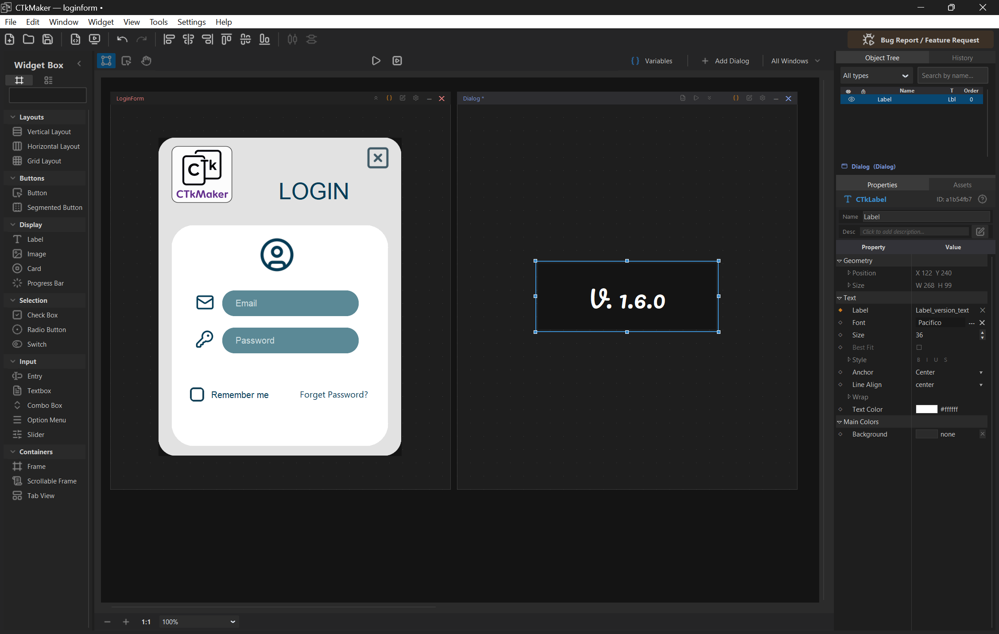
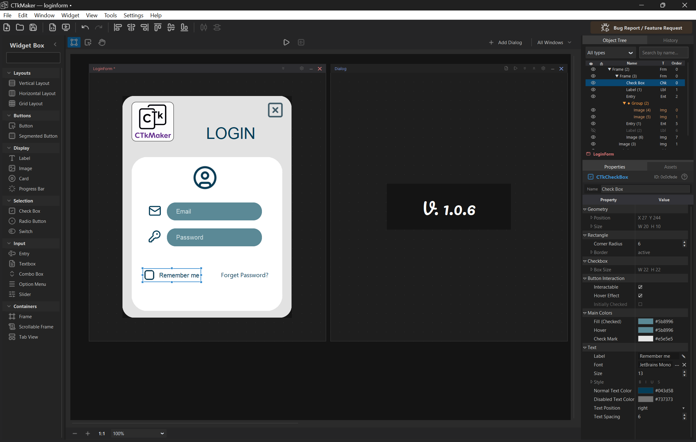
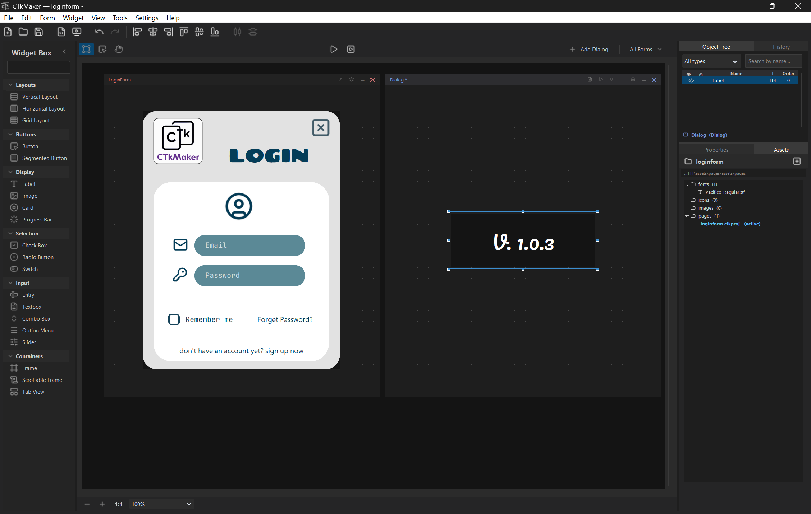
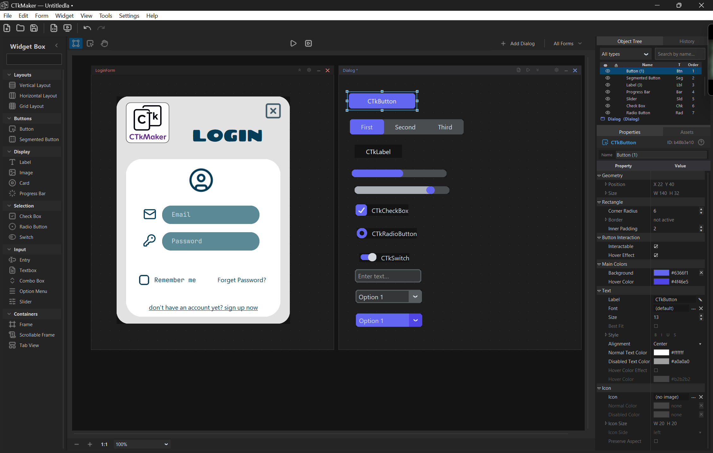
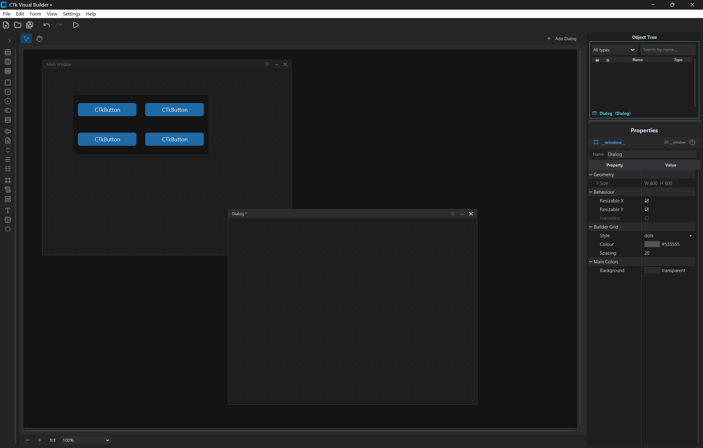
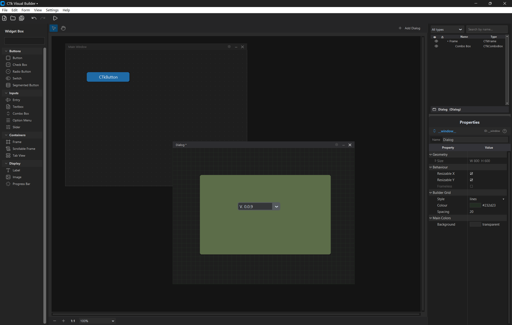
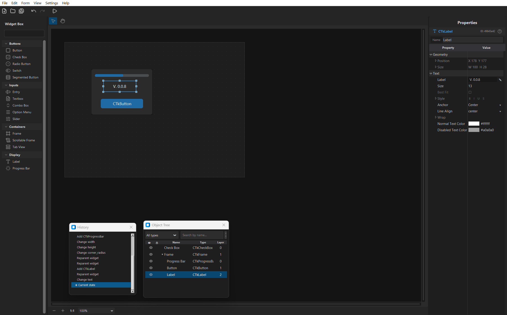
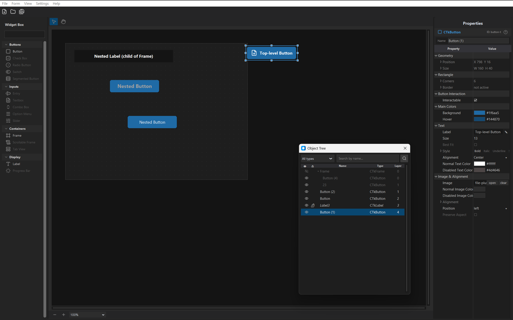
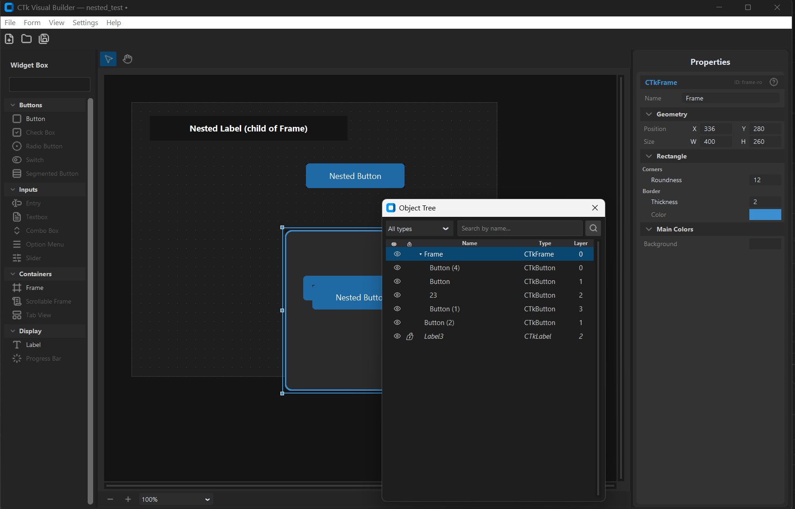

# Version history

Visual snapshots of CTkMaker across releases. Screenshots only on the milestones that introduced something visibly new.

| Version | Screenshot | Highlights |
|---------|-----------|------------|
| **v1.9.8** | _no screenshot_ | **Exporter threads user-set widget Names through to exported attribute names.** Pre-1.9.8 the Properties-panel "Name" field was decorative — `_make_var_name` ignored `WidgetNode.name` entirely and every widget got `<type>_<N>` regardless of what the user typed. Phase 2 behavior files calling `self.window.submit_btn` crashed at runtime with `AttributeError` because the actual attribute was `self.window.button_1`. Behavior Field replays at Phase 3 had a parallel bug (`_build_id_to_var_name` reimplemented the same legacy logic). v1.9.8 unifies both walks behind one resolver — `_resolve_var_names(doc)` consults `node.name` first (passes `str.isidentifier`, not in `keyword.iskeyword`, not in the reserved set — static `_RESERVED_VAR_NAMES = {"_behavior", "_build_ui"}` joined with the lazy `_ctk_inherited_names()` snapshot of `dir(ctk.CTk) ∪ dir(ctk.CTkToplevel)` so user names that would shadow `title` / `geometry` / `mainloop` / `destroy` / `configure` / `protocol` / `after` / `bind` / `winfo_*` / `wm_*` / CTk's own scaling internals get caught automatically — ~280 inherited methods, kept in sync with whatever CTk version is installed), suffixes duplicates `_2`/`_3` (mirroring the variables-system convention), and falls back to the legacy `<type>_<N>` counter when the name is empty / invalid / reserved. Counter candidates that would collide with a user-pinned name bump forward instead of overwriting. The resolver is memoised per `generate_code` call via `_NAME_MAP_CACHE` so the live emit walk + Behavior Field replay never produce conflicting names. Drops are logged in `_VAR_NAME_FALLBACKS` with `(doc_name, intended, fallback, reason)` tuples; F5 preview launchers read them via `get_var_name_fallbacks()` and show a yes/no warning dialog before spawning the subprocess (same pattern as v1.9.1's missing-method dialog) — without the warning, exotic shadowing would surface as a silent runtime AttributeError. Tests: 15 new cases — name priority, duplicate suffixing, keyword/identifier/reserved validation, counter-collision bumping, memoisation single-log invariant, nested DFS order, end-to-end exported-source assertions. Backwards compatible: every existing project where users left names blank renders byte-identical to v1.9.7. |
| **v1.9.7** | _no screenshot_ | **Free-form `.py` files in the Assets panel land in the configured editor + starter template caught up to Phase 3.** Two small consistency fixes around user-authored scripts. **(1)** Double-clicking a `.py` row in the Assets panel now routes through `launch_editor` (Settings → Editor tab) the same way F7 / Events "Open in editor" does — VS Code with line-jump, Notepad++, IDLE, or whatever the user pinned. The pre-1.9.7 path called `os.startfile(str(path), "edit")` which falls back to the registered Windows `.py edit` verb (often Notepad or nothing) and bypassed the editor preference entirely; users got two different editors depending on which entry point they used. The OS-default branch survives as a fallback for everything else (Markdown, images, fonts, etc.). **(2)** `_python_starter_template` no longer claims a "v0.2 behavior layer" is on the roadmap — Phase 2 + Phase 3 already shipped that work. Replaced with a one-paragraph helper-module pointer that explains where event handlers actually belong (`assets/scripts/<page>/<window>.py`, surfaced through the Properties panel Events group), so users opening a fresh script aren't sent down a stale path. |
| **v1.9.6** | _no screenshot_ | **Canvas regression fix — Entry's `apply_state` no longer clobbers `textvariable`-bound content.** When `CTkEntry.initial_value` is bound to a Local Variable, `resolve_bindings` strips the property from `clean_props` and adds `textvariable=<tk_var>` to the constructor — so the entry mirrors the var's value automatically. Pre-1.9.6 the descriptor's `apply_state` then ran `widget.delete(0, "end")` because `properties.get("initial_value")` came back empty (stripped). Tk's `textvariable` sync is bi-directional, so the delete propagated up and **cleared the variable for every other widget bound to it** — Labels reading the same var ended up empty too. v1.9.6 detects the bound state via `widget.cget("textvariable")` at the top of `apply_state` and short-circuits the placeholder/clear plumbing, leaving the textvariable to drive the entry's content unobstructed. Verified end-to-end: Entry + Label sharing the same var both render the var's value on the canvas. |
| **v1.9.5** | _no screenshot_ | **Variables work everywhere — auto-trace generation for non-`textvariable` widget properties.** Pre-1.9.5 the variable system only delivered live updates for the eight (widget, property) pairs in `BINDING_WIRINGS` (CTkLabel.text, CTkEntry.initial_value, CTkSlider, CTkSwitch, CTkCheckBox, CTkSegmentedButton, CTkOptionMenu, CTkComboBox). Everything else — CTkButton.text, CTkButton.fg_color, CTkTextbox content, theme colors shared across widgets — accepted the bind in the Properties panel but didn't react to `var.set(…)` at runtime; CTkTextbox even rendered the literal `var:<uuid>` token because its content path is `.insert("1.0", …)` post-construction. v1.9.5 closes that gap. The exporter emits two helper functions at module scope when needed (`_bind_var_to_widget` for `configure(prop=…)`-based updates, `_bind_var_to_textbox` for `delete + insert` content swap), then drops one call per binding right after each widget's construction. Helpers are gated on actual usage so projects that only carry `BINDING_WIRINGS` bindings stay byte-identical. State_props now resolves remaining `var:<uuid>` tokens to the variable's current value before reaching `descriptor.export_state`, so initial paint shows the var value (not the raw token) for delete/insert-style widgets. Tests: 5 new cases — button trace emit, textbox helper emit, pure-textvariable projects skip helpers, textbox initial value resolution, exported file compiles clean. ~10% line increase on bound-heavy projects, 0% on pure Phase 1.5 reactive projects. |
| **v1.9.4** | _no screenshot_ | **Behavior Field picker actually persists.** Hot bug fix — `[Pick…]` opened the modal, the user picked a widget, the dialog closed, but the slot stayed empty. Cause: `history.push` records an already-applied command (drops the redo stack and stops); SetBehaviorFieldCommand was being pushed without first running its `redo` so the model never mutated and the `behavior_field_changed` event never fired. Fix: every Behavior Field call site (`_show_behavior_field_picker`, `_clear_behavior_field`, `_show_add_behavior_field_dialog`, `_delete_behavior_field`) now calls `cmd.redo(project)` before `history.push(cmd)` — same pattern Phase 2's BindHandlerCommand uses. |
| **v1.9.3** | _no screenshot_ | **Behavior Field deletion + widget-delete cascade.** Two bug fixes that emerged during the v1.9.2 testing pass. **(1)** Right-click on a Behavior Field row now opens a menu with Open in editor / Clear binding / **Delete field…** — last entry runs `delete_behavior_field_annotation`, an AST-anchored text-mutator that removes the `<name>: ref[…]` line (preserving blank lines + comments around it) and clears the saved widget binding via `SetBehaviorFieldCommand`. Pre-1.9.3 the only delete path was hand-editing the .py source. **(2)** Deleting a widget that's bound to a Behavior Field now auto-clears the binding instead of leaving a dead `(missing widget)` row in the panel. `DeleteWidgetCommand` + `DeleteMultipleCommand` capture the cleared bindings on redo and replay them on undo, so a widget restore brings its slot back too. The cleanup walks every document's `behavior_field_values` (not just the active one), publishes one `behavior_field_changed` event per cleared slot. Tests: 8 new cases — annotation delete (line removal, no-op for missing field, syntax-error guard), id snapshot walker, single-doc cascade clear, multi-doc cascade clear, undo replay, missing-doc skip. |
| **v1.9.2** | _no screenshot_ | **Orphan handler red-glyph indicator.** Properties panel's Events group now flags handler bindings whose methods don't exist in the per-window behavior class: row label gets a `❌` prefix, value cell becomes `<method> (missing in file)`, and a soft-red `missing_method` foreground tag tints the whole row. Caused by class-level vs module-level indent slips, manual method renames in the .py source, or a stale binding pointing at a deleted def — exactly the case where v1.9.1's pre-spawn warning catches the same issue at preview time. The panel-level cue lets the user spot the break the moment they look at the widget instead of waiting for F5. New `_lookup_existing_method_names(node)` AST-scans the per-window class on every panel rebuild; falls through to "no check" for unsaved projects / missing files so the panel renders identically to v1.9.1 in those cases. |
| **v1.9.1** | _no screenshot_ | **Orphan handler defensive export.** When a behavior file has handler bindings whose methods don't exist in the .py source (user deleted them in the editor, file was overwritten, etc.), the exporter used to emit `command=self._behavior.<missing>` references that crashed the preview at widget construction with `AttributeError`. v1.9.1 pre-scans every doc's behavior file at export start (`_scan_behavior_methods_for_export`), filters handler bindings against that set in `_emit_handler_lines`, and surfaces the skipped methods to the F5/dialog preview launchers. The user gets a yes/no `messagebox.askyesno` listing missing methods clustered by document — proceed and the binding silently disappears for this run, or back out to fix the file first. Tests: 3 new cases covering filter keeps/drops, missing-scan-data fall-through, and missing-project fall-through. |
| **v1.9.0** | _no screenshot_ | **CircularProgress widget + scrollable place-layout fix + Phase 3 `_runtime.py` location fix.** Adds `CircularProgress` — a custom (non-CTk) circular progress ring built on `tk.Canvas`: track + progress arcs with optional centered % readout, live `set(percent)` for runtime updates, redraws on canvas resize. The runtime class lives at `app/widgets/runtime/circular_progress.py` and the exporter inlines its source verbatim into generated `.py` files so the export stays self-contained (no CTkMaker dependency at runtime). Defaults match `CTkProgressBar` (`#4a4d50` track, `#6366f1` progress) for visual consistency with the rest of the palette. New `is_ctk_class` flag on `WidgetDescriptor` so the exporter knows to skip the `ctk.` prefix for inlined custom widgets. Bundled bug fixes: **CTkScrollableFrame with `place` layout** now sizes its inner `tk.Frame` manually — place children don't trigger the `<Configure>` auto-grow that vbox/hbox/grid rely on, so the inner frame stayed 0×0 and place'd children rendered outside the visible canvas; CTk widget-scaling is applied so scroll content correctly overflows the viewport on hi-DPI displays. **Phase 3 `_runtime.py` location** — `ensure_runtime_helpers` was using `ensure_scripts_root()` (which returns the per-page subfolder) instead of `scripts_root()`, so `_runtime.py` got created at `scripts/<page>/_runtime.py` and behavior files' `from .._runtime import ref` couldn't resolve. |
| **v1.8.2** | _no screenshot_ | **F5 preview pause-on-error.** When an exported preview crashes — `ModuleNotFoundError`, runtime exception in a behavior method, etc. — the spawned console window used to close instantly, taking the traceback with it. v1.8.2 wraps every preview launch (main + per-dialog) through an auto-generated `preview_runner.py` next to `preview.py`: the runner spawns the inner Python, then on non-zero exit prints `"Preview exited with code N. Press Enter to close..."` and waits for the user's Enter key. Clean exits (return code 0) close the console immediately, matching the previous behaviour. Catches stacked import / runtime errors that v1.8.0/1.8.1 used to swallow. |
| **v1.8.1** | _no screenshot_ | **Phase 3 Step 1 polish — Add Field dialog.** The Properties panel's "Behavior Fields" group gains a `[+]` button on its header that opens a modal `AddBehaviorFieldDialog`. Pick any widget on the scene; the dialog auto-suggests a Python identifier from the widget's display name (slugified, collision-suffixed) and writes both the `<name>: ref[<WidgetType>]` annotation + the matching `from .._runtime import ref` and `from customtkinter import <Type>` imports into the behavior file in one step — no hand-editing the .py source. AST-based mutators (`add_behavior_field_annotation`, `ensure_imports_in_behavior_file`, `ensure_relative_import_in_behavior_file`) preserve user blank lines and comments, anchor inserts above the first method (PEP 8 styling), skip duplicate imports, and group same-module imports into one row. Behavior Fields group also moves: it now appears on every selection (widget OR window) instead of just window selection, and hoists right after the Events group when present so the scripting affordances cluster together visually. Empty state hint stays in place for users who prefer hand-editing. |
| **v1.8.0** | _no screenshot_ | **Phase 3 Step 1 — Behavior Fields.** Per-window behavior class gains Inspector slots: declare `target_label: ref[CTkLabel]` on the class and the Properties panel grows a **Behavior Fields** group (window selection only) with a `[Pick…]` button per slot. Click → modal `WidgetPickerDialog` opens with the window's widget tree, type-incompatible widgets greyed-out, double-click or Pick to assign. Slot bindings persist in `Document.behavior_field_values` and round-trip through the .ctkproj. Inline `[✕]` clears the binding for one-click unbind. Exporter wires `self._behavior.<field> = self.<widget_var>` after `_build_ui()` so user code can lean on slots being populated. **`setup(self)` moved post-build** — runs after Behavior Fields wiring so user code accesses both widgets + slots without ordering tricks. Auto-generated `assets/scripts/_runtime.py` ships a tiny `ref[T]` marker class (Generic, runtime no-op) so behavior files stay importable as standalone Python in any IDE. `_doc_needs_behavior` broadens the per-window class gate to cover field-only docs (annotations + bindings, no event handlers yet). Behavior file skeleton docstring documents the `ref[<WidgetType>]` syntax + post-build setup contract. |
| **v1.7.0** | _no screenshot_ | **Phase 2 Step 3 — visual scripting polish.** Window deletion now opens a confirmation dialog that surfaces what's about to disappear (widgets / local variables / behavior-script line count) and asks where the script should go: **Move to Recycle Bin** by default (recoverable via the OS trash through `send2trash`) or **Save copy to** a default `<project>/assets/scripts_archive/<page>/<window>.py` path (auto `_2`/`_3` suffix on collision). The active scripts folder always ends up clean — `_deleted/` orphans no longer accumulate inside the project. Action deletion gets the same treatment with three buttons (Cancel / Open in editor / Delete); the dialog warns when the same method is bound to other rows so deleting the def doesn't silently break them. Renaming a window now renames the per-window `.py` and rewrites the class header inside (text-based, blank lines + comments survive). Object Tree gains a ▶ marker on widgets with at least one bound handler. Edit menu adds **Edit behavior file…** (F7) for one-keypress jump into the active window's behavior script. New Dialogs auto-save the project so an exit-without-save no longer leaves an orphan `.py` for a window that the .ctkproj never registered. Adding an action (right-click cascade or Properties panel `[+]`) no longer auto-launches the editor — the row appears immediately, the editor opens only on double-click / F7 / right-click → Open. |
| **v1.6.0** | _no screenshot_ | **Phase 2 visual scripting — event handler stubs.** Widgets that fire events (CTkButton, Slider, Switch, Checkbox, Radio, ComboBox, OptionMenu, SegmentedButton, Entry/Textbox bind events) gain a multi-method handler list: pick a button on the canvas and the Properties panel grows a Unity-style **Events** group right after the Colors group, with one row per event and per-method action rows underneath (`[+]` to add, `[↑]`/`[↓]` to reorder, `[✕]` to unbind). Each window owns its own behavior class in `<project>/assets/scripts/<page>/<window>.py`; the file appears the moment a window is created and the exporter wires it up automatically — single-method binds become `command=self._behavior.method`, multi-method binds become a `lambda: (m1(), m2())` chain, bind-style events use `widget.bind(seq, fn, add="+")`. F5 preview pops the subprocess in its own console window so user `print()` and tracebacks stay visible. **Editor preferences:** new Settings tab with 4 presets (Auto / VS Code / Notepad++ / IDLE) plus Custom; auto-detect resolves VS Code through known Windows install paths to defeat Git Bash / MinGW `code` shadowing, falls back through Notepad++ to `python -m idlelib`. VS Code recommendation block carries a clickable download link and a hint that a CTkMaker VS Code extension is on the roadmap. |
| **v1.5.0** | _no screenshot_ | Whole windows can now be saved as components, not just individual widgets — right-click the canvas to bundle a dialog with all its widgets, properties, and local variables, then drop it into any project to spawn a fresh Toplevel. Window components are visually distinct in the panel (dark orange) so the different drop behaviour is obvious. **The CTkMaker Hub** — a brand-new community site at **`kandelucky.github.io/ctkmaker-hub/`** — went live this release. It's where users browse and share components; the landing page explains what CTkMaker is, leads with the Free / Open-Source / MIT pitch, and links straight to Discussions and bug reports, with the component library on its own page. Sharing a component goes through a Publish flow that produces a `.ctkcomp.zip` (GitHub Discussions accepts it directly, no renaming required); local components keep the shorter `.ctkcomp`. |
| **v1.4.0** | _no screenshot_ | **Publish-to-Community + asset bundling.** Export now branches into Personal use vs Publish to Community. Publish gates through a License agreement (3 confirmations + MIT viewer) then a form with required Author / Category / Description (10 categories link to the wiki guide) + a 25 MB Hub-site cap. License + category + description embed into `component.json`. Asset bundling (Phase B2): widget images travel inside the `.ctkcomp` and extract into `<project>/assets/components/<slug>/` on insert with auto `_2`/`_3` folder suffixes. Schema bumped 1 → 2. |
| **v1.3.1** | _no screenshot_ | **Palette tab redesign + Edit › Export Component.** Widgets / Components tabs switch from icon-only to full-width text (stacked); collapse-to-icon-strip mode dropped. Edit menu gains Export Component… for the entry selected in the Components panel. |
| **v1.3.0** |  | **Cross-doc reparent dialog + per-project component library.** Moving a widget across windows (drag or Ctrl+C/V/X) asks how to handle its local-variable bindings — Keep / Delete in source, Duplicate / Unbind in target. Components live under `<project>/components/` with save / export / import / preview dialogs. |
| **v1.2.0** | _no screenshot_ | **Local variables + prefab library.** Variables window splits into Global / Local tabs; bindings auto-migrate on cross-doc moves. Exporter routes globals to the main class, Toplevels read `self.master.var_*`. Prefabs save selections as reusable `.ctkprefab` files. |
| **v1.1.0** | _no screenshot_ | **Group hide/lock + group-aware alignment.** Virtual `◆ Group` row gains eye + lock cells — batch toggle as one undo step. Alignment + distribution treat a selected group as a single block. Preview windows ship with a floating **Screenshot · F12** button. |
| **v1.0.6** |  | In-app **Bug / Feature reporter** — Help menu + toolbar button open a structured form that submits via GitHub Issue Form template URL or markdown export. Plus a hotfix to v1.0.5's group selection (Ctrl+Click toggles whole group, orange bbox follows during drag). |
| **v1.0.5** | _no screenshot_ | **Group / Ungroup widgets** (Ctrl+G / Ctrl+Shift+G). Click a member targets the whole group, fast follow-up drills to one, drag carries the group as one. Object Tree shows a virtual `◆ Group (n)` parent row. |
| **v1.0.4** | _no screenshot_ | **Marquee selection + smart snap guides.** Drag-rect on empty canvas multi-selects (Photoshop touch mode). While dragging a widget, cyan guides snap edges / centre to siblings + container; Alt bypasses. |
| **v1.0.3** |  | **Alignment + distribution toolbar** — 6 align (L/C/R + T/M/B) + 2 distribute (H/V). Auto-detects intent: 1 widget aligns to its container, multiple widgets align to each other. |
| **v1.0.2** | _no screenshot_ | **Multi-page projects** (Unity-style workspace). One project folder, multiple Page designs sharing a single asset pool. Save As gains 3 scopes; Export ships only used assets per page. |
| **v1.0.1** |  | **Card widget** with embedded image (anchor / tint / padding / preserve-aspect) plus a bug sweep across drop coords, hidden frames, eye-icon cascade, and Save As asset copy. |
| **v1.0.0** | _no screenshot_ | **First stable release.** Visual canvas, 19-widget palette, multi-document workspace, layout managers (place / vbox / hbox / grid), asset system, code export, undo/redo with History panel. |
| **v0.0.15.x** | _no screenshot_ | **Area 1 workspace QA + perf refactors** across 9 patches — selection chrome z-order, frame-pool for multi-select draw, drag controller decomposition, ghost-mode for large group drags, cross-doc reparent undo. |
| **v0.0.14** |  | **Grid place-based centring + workspace refactor.** CTkFrame's rounded canvas broke tk's native `.grid()` math; children now render via hand-computed `.place()` coords. WidgetLifecycle extracted from workspace core. |
| **v0.0.13** | _no screenshot_ | **Grid WYSIWYG + drag-to-cell.** Children render into real cells; drag snaps to cell under cursor with light-blue dashed outline. Runtime export emits matching `grid_propagate(False)` + weight calls. |
| **v0.0.12** | _no screenshot_ | **vbox / hbox WYSIWYG + Layout presets.** Children render with real `pack()` on canvas — builder preview matches exported runtime. Palette gains 4 layout presets. workspace.py split into a 6-file package. |
| **v0.0.11** | _no screenshot_ | **pack split into vbox / hbox.** Direction now lives on the parent (Qt Designer convention). Properties dropdown renders Lucide icons per option. Legacy `.ctkproj` files auto-migrate. |
| **v0.0.10** | _no screenshot_ | **Layout managers (stage 1 + 2).** Containers gain `layout_type` ∈ `place / pack / grid`; properties panel shows parent-driven children rows; code exporter swaps `.place()` per parent. |
| **v0.0.9** |  | **Multi-document canvas.** One `.ctkproj` holds Main Window + N Dialogs, all visible together. Per-document chrome with drag, active highlight, palette drop targeting, AddDialog preset picker. |
| **v0.0.8** |  | **Phase 3 widgets + Undo / Redo.** 13 widgets land (Entry, CheckBox, ComboBox, …). Full command-based history with the History panel (F9). |
| **v0.0.7** |  | **Properties panel v2 rewrite** — ttk.Treeview backbone, flicker-free overlays, modular editor registry. |
| **v0.0.6** |  | First widgets — CTkLabel / CTkFrame, workspace canvas, startup dialog. |
