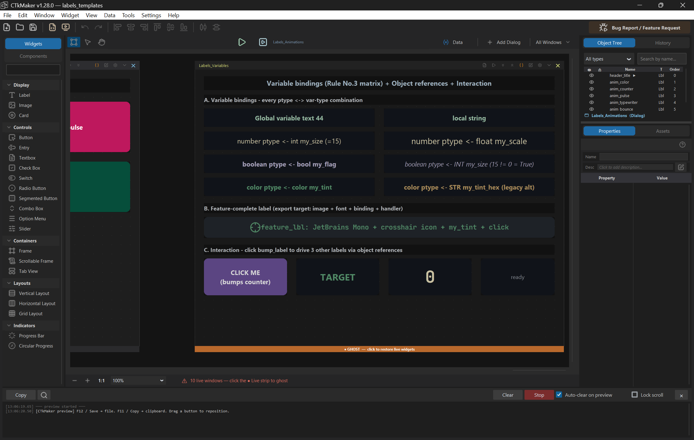
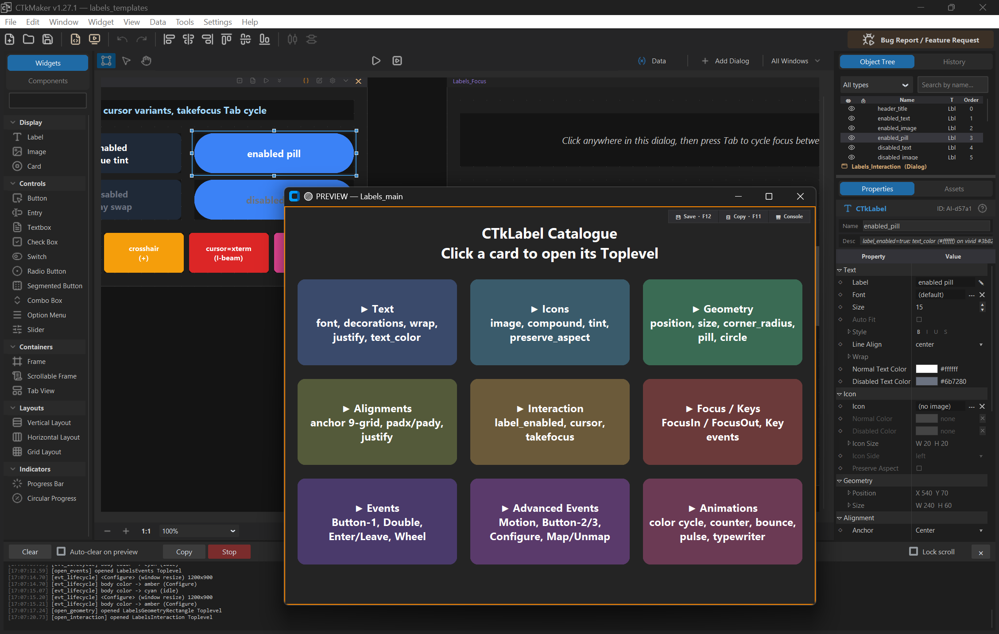
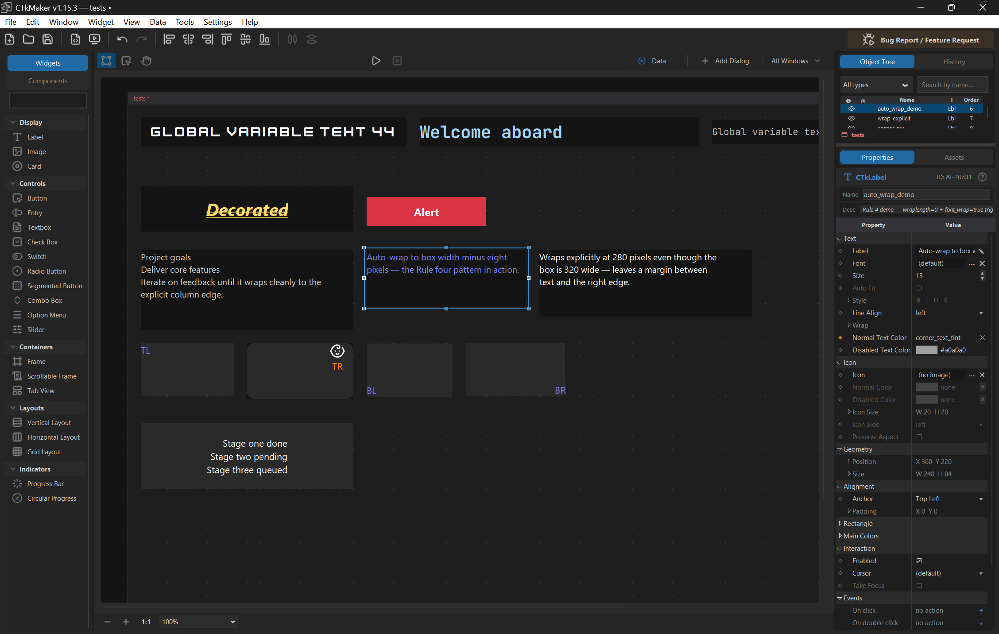
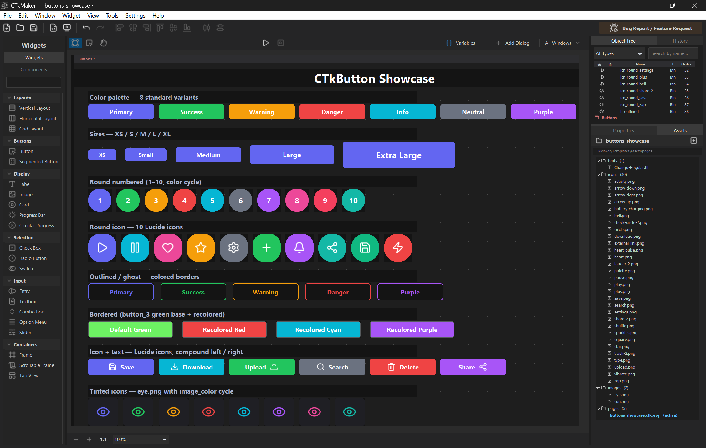

# Version history

Visual snapshots of CTkMaker across releases. Screenshots only on the milestones that introduced something visibly new.

| Version | Screenshot | Highlights |
|---------|-----------|------------|
| **v1.32.0** | _no screenshot_ | **CTkButton — Unity ColorBlock state-colour model.** Replaces the eight per-state colour fields (`fg_color`, `fg_color_disabled`, `hover_color`, `text_color_disabled`, `text_color_hover`, `text_hover_color`, `image_color_disabled`, `border_color_disabled`) with one base + three tint multipliers + a `Disabled Fade` toggle. Inspired by Unity UI's ColorBlock — `Normal × Hover Tint`, `Normal × Pressed Tint`, `Normal × Disabled Tint` (multiply per-channel, clamped) — the full state palette is derived at render time by the new `ctk.derive_state_colors()` helper in ctkmaker-core 5.4.20. Defaults: `Hover Tint = #f5f5f5`, `Pressed Tint = Disabled Tint = #c8c8c8` (Unity Inspector defaults); when `Disabled Fade` is on the disabled state also blends toward the workspace surface so the dim effect is visible without users picking a separate disabled colour. Text / icon / border each keep a single colour input — they fade automatically when `Disabled Fade` is on, otherwise CTk auto-derives the disabled variant. Project loader migrates legacy `.ctkproj` files on open — `fg_color → normal_color`, all eight legacy per-state keys dropped, Unity defaults seeded. ctkmaker-core companion additions: **5.4.18** `pressed_color` (visible bg colour during the click hold, replacing the leave→enter flash for buttons that opt in); **5.4.19** `border_color_hover/pressed` + `image_color_hover/pressed` rounding out the per-state colour matrix; **5.4.20** top-level `tint_color` / `fade_color` / `derive_state_colors` utilities. |
| **v1.31.2** | _no screenshot_ | **Fork crutch migration — image tint / aspect now handled natively by ctkmaker-core.** Three-phase removal of the hand-rolled PIL recolour + contain-fit code, now that `CTkImage` exposes `tint_color` / `preserve_aspect` and `CTkButton` / `CTkLabel` expose `image_color` / `image_color_disabled`. **v1.30.4** editor-side — the four image-bearing descriptors drop `_tint_image` + the aspect math; `_build_image` just loads the PNG and hands `preserve_aspect` to `CTkImage`, tint resolved into the widget's `image_color` kwarg. **v1.31.1** exporter construction — `_image_source` emits a plain `CTkImage(preserve_aspect=…)` + native tint kwargs; the dual-CTkImage `_wire_icon_state` mechanism and `_aspect_corrected_size` removed. **v1.31.2** exporter var bindings — image params bound to a variable configure the widget's native kwargs / its `CTkImage` directly instead of rebuilding from a `_maker_image_state` dict. `_tint_image` no longer exists anywhere; behaviour unchanged. |
| **v1.30.3** | _no screenshot_ | **Fork crutch migration — editor-side workarounds removed now that ctkmaker-core handles them natively: font / keyboard (v1.30.1), button text-hover colour (v1.30.2), checkbox / radio / switch text position (v1.30.3).** Pure cleanup, behaviour unchanged; plus a `.gitignore` tidy-up and a stale-comment fix. |
| **v1.29.0** | _no screenshot_ | **Live composite variable bindings + 10-file structural refactor.** Two work streams bundled into one minor bump. (1) Variable-bound properties now propagate live across composite re-builders: font-related sub-properties (`font_family`, `font_weight`, `font_slant`, `font_underline`, `font_overstrike`) and image variants (`image_color_disabled` + `image_color_enabled` coordination), plus x/y geometry and image rebuilds for runtime widget recreation. The earlier per-property recreate path couldn't catch sub-property edits routed through composites; the new rebuilders walk the affected widget subtree and rebuild the right view without disturbing siblings. Var-bound font composites also pick up the bool default switch UI from v1.28.4 + a muted `[my windows]` marker on the main document title from v1.28.3. (2) Internal-only refactor: ten files split into focused packages / mixins / sidecars using three established patterns — `io/code_exporter.py`, `ui/dialogs.py`, `core/commands.py`, `io/scripts.py`, `ui/transitions_demo_window.py` converted to packages with sub-modules; `ui/main_window.py` split into 5 sibling mixins; the workspace package's three biggest files (`core.py`, `drag.py`, `chrome.py`) split into helper sidecars (workspace pattern picked over mixins for consistency); `ui/project_window.py` similarly split into 5 panel helpers. ~16,500 lines reorganised, zero behaviour change — every public method / class / event-bus subscription kept its name via pass-through shims where external callers already depended on it. |
| **v1.28.2** | _no screenshot_ | **Ghost cleanup on delete + dialog auto-shift + Arrange menu.** Three small canvas-layout improvements bundled together. (1) Deleting a ghosted dialog used to leave its desaturated screenshot stranded on the canvas — `Renderer.redraw` only clears `DOC_TAG / GRID_TAG / CHROME_TAG / LAYOUT_OVERLAY_TAG`, never the per-doc `ghost:<id>` tag. New [GhostManager.purge](../../app/ui/workspace/ghost_manager.py) drops the image item + dict entry; workspace.core subscribes to `document_removed` and calls it. (2) Deleting a dialog now auto-shifts every right-side neighbour whose Y range overlaps it left by `width + 120 px`, so a row of `[Main][Dialog A][Dialog B]` collapses cleanly when the middle one goes — `DeleteDocumentCommand` carries the shift snapshots so undo restores positions too. Vertically separate dialogs aren't touched. (3) The "All Windows" dropdown gains **Arrange Horizontally** / **Arrange Vertically** entries (shown when 2+ visible docs exist). Sorts dialogs alphabetically by name and lines them up along the chosen axis with a 120 px gap; Main Window is pinned to slot 0 regardless of name order. New `ArrangeDocumentsCommand` captures every moved doc for atomic undo. |
| **v1.28.1** | _no screenshot_ | **Variables + Object References: page-scoped (was project-wide).** Globals (variables and object references) lived in `project.json` and got reloaded on every page switch, making them de-facto project-wide. Both lists move into each page's `.ctkproj` — `project.variables` now naturally represents the active page's set. Loader falls back to `project.json` on first open of legacy projects so the active page picks up the old globals; next save drops them from `project.json`, completing the migration silently. Non-active pages don't inherit the legacy globals (acceptable — pages already export as independent `.py` files). No exporter changes needed. Spec docs updated (DATA_MODEL, CONCEPTS, AI_CHEATSHEET, EXPORT). |
| **v1.28.0** |  | **Ghost Mode v2 — statusbar toggle + screenshot persistence + lag hint.** The per-doc `square-check` chrome icon is replaced by a always-visible **ghost statusbar** along each doc's bottom edge — neutral grey `● Live  —  click to ghost` or bright carrot `● GHOST  —  click to restore live widgets` with a hover tooltip ([render.py](../../app/ui/workspace/render.py) `_draw_ghost_statusbar`). Click the strip *or* the desaturated PIL screenshot to flip state; on a ghosted doc the first click only focuses, a second click on the now-active ghost actually rebuilds widgets (cheap live → ghost stays one-click). **Persistence**: every fresh capture is cached on `Document._cached_ghost_pil`, encoded as base64 PNG into the new `ghost_image` field of `Document.to_dict`, and toggling ghost ON now triggers an immediate `save_project` ([main_window.py](../../app/ui/main_window.py) `_on_ghost_toggled_save`) so the frozen image survives close-without-save. Load reads the cache via `GhostManager.freeze_from_cache` — no more `ImageGrab` race against the startup paint that captured splash / IDE underneath. **Live-window hint**: the bottom zoom bar shows a reddish `⚠  N live windows — click the ● Live strip to ghost` label whenever 2+ live (non-ghost, non-collapsed) docs share the canvas — pure state-based, no timing heuristics, disappears the moment the user ghosts enough docs to fall under the threshold. Side fix: startup `focus_document` deferred via `after_idle → after(100)` so the active doc lands centered against the paned window's actual width, not the canvas's pre-layout placeholder. |
| **v1.27.11** | _no screenshot_ | **Toolbar Preview buttons.** Bigger icons (36×30, pastel green/blue), slate label beside Preview Current shows the active dialog name. Fix: project Preview tracks main window only — empty dialogs don't deactivate it. |
| **v1.27.2** |  | **Console — auto-clear on preview start.** Toolbar checkbox next to Clear toggles whether the in-app console is wiped before each F5 preview. State is shared between the docked panel and the floating window via one `BooleanVar` on MainWindow and persisted as `console_clear_on_preview_start` in settings. Default off; only fires in inapp console mode. |
| **v1.27.1** | _no screenshot_ | **Tools → Color Palette designer reference.** 15 named palettes × 9 colors (3 muted + black/white mono + Material / Tailwind / Nord / Dracula / Gruvbox / Tokyo Night / Catppuccin / Solarized / Monokai / One Dark). Click a swatch to copy its hex. Window auto-fits content on first open via `update_idletasks` + `winfo_reqheight` — hardcoded default_size proved unreliable across DPI / font scaling. |
| **v1.27.0** | _no screenshot_ | **Ghost Mode — per-doc screenshot freeze.** Each doc's chrome carries a `square-check` icon (gray when off, dark carrot when on); clicking flips `Document.ghosted`. ON path: `GhostManager.freeze` scrolls the doc into the viewport (PIL.ImageGrab can only capture on-screen pixels), grabs the rect, runs the desaturate filter (`Color × 0.4`, `Brightness × 0.85`), destroys live widgets via `lifecycle.destroy_widget_subtree`, places one canvas image item raised above the doc rect/grid/chrome. OFF path: deletes the image, rebuilds widget subtrees. Persisted to `.ctkproj` via the new `ghosted` field — load defers freezing through a `_pending_ghost` flag so widgets are alive when the screenshot runs. Zoom rescales every ghost image via PIL.Image.resize → fresh PhotoImage; pan rides Tk's native viewport shift (no per-image work). Activating a ghosted doc demotes the active flag to the next non-ghosted doc, mirroring the collapse fallback rule. |
| **v1.26.0** | _no screenshot_ | **Transitions Demo — code generators for all 5 categories.** Tools → Transitions Demo now exports self-contained Python modules for every demo, not just button press effects. Card / Text / Loaders / Popups / Toasts all dispatch through one `_assemble_module` builder that emits imports, the requested easings, the Tween engine, helpers, the animation function, and a runnable `__main__` block. |
| **v1.25.0** | _no screenshot_ | **Minimize windows to a bottom tab strip.** Per-doc chrome chevron-down + Window > Visibility menu collapse a form into a compact chip in a new strip docked above the status bar (`collapsed_tabs_bar.py`); right-click on a window also surfaces "Minimize Window". Collapsed docs persist `collapsed: bool` to `.ctkproj`, skip widget instantiation entirely (lazy-built on restore), and restore at the saved canvas position — auto-shifted to the right of all visible docs if that slot is now occupied. Loader stops flashing through every doc on multi-doc load — active-document publishes collapse to a single redraw at the end. |
| **v1.15.7** | _no screenshot_ | **`preserve_aspect` contain-fit + `image_height` always editable.** Two related bugs: (1) on the Image widget, drag-resizing wrote `width` and `height` in two separate `update_property` calls and `compute_derived` raced — the width-derived height was clobbered by the drag's raw height the very next call, so the picture stretched until the user toggled `preserve_aspect` off and on. (2) on icon-bearing widgets (CTkLabel / CTkButton / Card), `compute_derived` only ran on property changes, so a project loaded from disk with a stale `image_height` under `preserve_aspect=True` rendered the icon stretched until a manual toggle. Both paths now fit the image inside `(W, H)` at render time inside `_build_image` — `scale = min(iw / native_w, ih / native_h)`, both dims scaled, smaller side dictates. `compute_derived` no longer touches `image_height`; `_native_aspect` / `_aspect_cache` removed (CTkLabel + CTkButton + Card). `image_height` becomes user-editable in every mode (the disabled-when-preserve-aspect rule is gone), so users can shape the icon's bounding box without flipping the flag off first. Exporter mirrors the same math via `_aspect_corrected_size` so generated `.py` matches the designer. Image widget defaults to `preserve_aspect=False` (was `True`). |
| **v1.15.3** |  | **Exporter parity fixes + version sync.** Two related export bugs that made `preview.py` diverge from the editor. (1) Descriptor-internal shadow keys (e.g. CTkLabel's `_font_size_pre_autofit`, stashed for autofit OFF→ON→OFF restore) leaked into the emitted constructor and crashed CTk's `check_kwargs_empty`. The exporter now reads `_SHADOW_KEYS` off the descriptor alongside `_NODE_ONLY_KEYS` / `_FONT_KEYS` so runtime + export filters stay symmetric — `transform_properties` already did this. (2) CTkLabel's "wrap on + length 0 → derive from width" rule was only applied at runtime, so exported labels with auto-wrap stayed on one line; the same translation now ships through `export_kwarg_overrides`. Plus: `app/__init__.__version__` was stale at 1.13.6 since the v1.13.6 → v1.15 backfill bumped only `pyproject.toml` — both files now reconcile at 1.15.3. |
| **v1.15.2** | _no screenshot_ | **Rename Best Fit label to Auto Fit.** UI rename only — the descriptor key stays `font_autofit`, the property panel label changes to read "Auto Fit" everywhere it appeared as "Best Fit". |
| **v1.15.1** | _no screenshot_ | **Object References tab toolbar + heading polish.** The third Data-window tab inherited Tk's default `Treeview.Heading` style — flat white headers that broke against the dark UI of the Local / Global tabs. Added the same `TREE_HEADING_BG` / bold Segoe UI 10 / flat-relief block the Variables panel uses, and switched body + section fonts from `derive_ui_font` to the `("Segoe UI", N)` tuple so all three data tabs render identically. Toolbar description shortened to one line so the wrap no longer clipped at the bottom edge, and `+ Add Global` renamed to `+ Add Window` since the button only ever creates Window / Dialog refs (locals come from the widget-panel toggle). |
| **v1.15** | _no screenshot_ | **Properties panel + palette reorder (Content-first).** Every widget descriptor reorders its group schema to Content → Layout → Visual → Behavior — Text / Icon / Values now sit at the top, Events + Object Reference at the bottom. Palette: 6 groups collapse to 5 — Display / Controls / Containers / Layouts / Indicators. Buttons + Selection + Input merge into Controls; Progress widgets split out of Display into the new Indicators group. Drops the `panel_schema` "hoist Events after last Color" heuristic since Events lands at end-of-schema naturally now. |
| **v1.14.6** | _no screenshot_ | **Rename `properties_panel_v2` → `properties_panel`.** Drops the v2 suffix from the package directory and the `PropertiesPanel` class. |
| **v1.14.5** | _no screenshot_ | **Label events split into Default + Advanced + tooltip descriptions.** The 11 high-frequency / niche label events (motion, configure, focus-in/out, key-press/release, …) move to a collapsible Advanced sub-group; the 5 common ones (Click, Double Click, Right Click, Enter, Leave) stay at the top. `EventEntry` gains a `description` field used in row tooltips — one-liner per event, filled for all 22. Tooltips also added to the Advanced sub-group, Object Reference group rows, and per-widget objref toggles. |
| **v1.14.4** | _no screenshot_ | **Property panel hover tooltips on Label rows.** Dark popup on label-column hover with a description + optional warning sourced from a new `property_help.py` dict — covers ~30 property rows plus 4 pair virtual rows (Position / Size / Padding / Icon Size) and 2 subgroups (Text/Style, Text/Wrap). 750ms hover delay; reuses `screen.get_screen_size()` for off-edge clamping. v1 scope is CTkLabel; event-header rows use `EventEntry.label` + `.warning` so they work for every widget already. |
| **v1.14.3** | _no screenshot_ | **Padding subgroup flatten + EventEntry warning docs.** Drops redundant `subgroup="Padding"` on Label's `padx` / `pady` — `pair="pad"` already keeps the two number fields on one row. Documents the `EventEntry.warning` field in EXTENSION.md (added in v1.14.2). |
| **v1.14.2** | _no screenshot_ | **Label: padding, cursor, takefocus, bg_color, 11 more events.** Label exposes the Tk-passthrough kwargs that were hidden — `padx` / `pady` (default 0), `cursor` (9-value enum), `takefocus`, plus `bg_color` (default transparent = CTk auto-derive from parent). The "State" group renames to "Interaction". `EventEntry` gains an optional `warning` field. Label adds 11 more bind events (16 total): middle / release / motion / wheel / configure / map / unmap / focus-in/out / key-press/release — six carry warnings for high-frequency firing or `takefocus` dependency. Side fix: italic-clipping `_ITALIC_SAFE_PADX = 4` workaround removed (user controls padding now). |
| **v1.14.1** | _no screenshot_ | **Label gains 5 bind-style events + spec doc updates.** EVENT_REGISTRY adds `<Button-1>`, `<Double-Button-1>`, `<Button-3>`, `<Enter>`, `<Leave>` for Label. CTkLabel has no `command=` kwarg, so all wiring is post-construction `.bind()` — handled by the existing generic exporter path. AI_CHEATSHEET + WIDGETS specs document anchor scope (whole content block), Option-B disabled visuals, and the Button-mirror image tint pipeline. |
| **v1.14.0** | _no screenshot_ | **Label feature parity: Icon, Rectangle, Alignment, State.** Label gains four new property groups for parity with Button — Icon (image, tint, size, compound, preserve_aspect — for avatars / badges / chips); Rectangle (corner_radius for pill / badge styling); Alignment (anchor split out from Text — positions the whole text+icon block, not just text); State (`label_enabled` + `text_color_disabled`, manual color swap instead of Tk `state="disabled"` to avoid Windows native white wash on the image). Compound dropdown gains a "center" overlap mode (Label / Button / Image). |
| **v1.13.9** | _no screenshot_ | **Group declarations below a darker spacer in window panel.** Per-window Object Reference toggle moves up to sit with other window-side properties (Geometry, Behaviour, Marker, …) instead of between Local Variables and the Object References list. A 28px `#121212` spacer row separates that block from Local Variables + Object References below, so the user reads the two zones — window properties vs. user-declared content — as visually distinct. |
| **v1.13.8** | _no screenshot_ | **Apply variable bindings on live property reconfigure.** `_apply_generic_configure` now runs `resolve_bindings` on `node.properties` before `transform_properties`, mirroring the create-time path. Pre-1.13.8 editing any property on a widget that already had a colour bound to a variable forwarded the raw `var:<uuid>` token through `widget.configure`, which raised inside CTk's colour validator and silently dropped every other kwarg in the same call (e.g. `text_color` edits stopped landing in the editor while still appearing correctly in preview / export). |
| **v1.13.7** | _no screenshot_ | **Double-click bound property → Variables window.** Properties panel intercepts `<Double-Button-1>` on a row whose value is a `var:` token before per-editor dispatch and publishes `request_open_variables_window` with the variable id; the window opens on the right scope tab and pre-selects the bound entry. Color editor drops its old swallow branch — `panel_commit` handles var-bound rows uniformly across colour / number / string. |
| **v1.13.6** | _no screenshot_ | **Color as a fifth variable type.** Variables window now offers `Color` as a fifth type alongside `String / Integer / Float / Boolean`. Color rows show a swatch in the panel + edit via picker (no more typing `#hex` into a String row). Color properties (`fg_color`, `text_color`, `border_color`, …) only see `color` + `str` variables in the bind menu. Workspace listens to `variable_default_changed` and repaints widgets with cosmetic bindings live on the canvas; wired bindings keep updating via Tk's `textvariable` / `variable`. |
| **v1.13.5** | _no screenshot_ | **Label autofit / wrap polish + project-load shadow-key filter.** `_compute_autofit_size` now accepts `wrap=True` and runs greedy word-wrap so multi-line Labels size correctly under Best Fit. `transform_properties` remaps `wraplength=0` → `width-8` when `font_wrap` is on, so the Wrap toggle actually wraps instead of leaving the lengths zero. `font_wrap` joins `derived_triggers` so toggling Wrap re-runs autofit live. Bug fix: a `_SHADOW_KEYS` set strips the v1.13.4 sentinel `_font_size_pre_autofit` before forwarding properties to `CTkLabel.__init__`, so projects that recorded autofit cycle history load cleanly. |
| **v1.13.4** | _no screenshot_ | **Best Fit toggle off restores the user's pre-autofit font size.** Pre-1.13.4 the OFF→ON→OFF cycle on Label's Best Fit cemented whatever font size autofit had derived — turning Best Fit back off left the autofit-derived size in `font_size` instead of returning to the explicit value the user set. v1.13.4 stashes the user value into `_font_size_pre_autofit` on the OFF→ON edge and restores it on ON→OFF. |
| **v1.13.3** | _no screenshot_ | **Multi-page save no longer overwrites the page-file `name` field.** Projects with multiple pages were having their per-page `name` clobbered on every save (the loader read the field but the writer was injecting the document title back over it). v1.13.3 splits read/write paths so the page file's persisted `name` survives Save / Save As / Quick Save. |
| **v1.13.2** | _no screenshot_ | **Object Reference annotation diagnostics + export test plan.** Annotation parser now surfaces line / column / message when a behavior file's `self.<name>: <Type>` slot fails to resolve, instead of silently dropping the binding. New `docs/spec/EXPORT_TEST_PLAN.md` codifies the export-roundtrip checklist. |
| **v1.13.1** | _no screenshot_ | **Behavior Fields → Object References terminology cleanup.** Last sweep through code comments, error messages, and panel labels — the legacy "Behavior Field" name is gone everywhere except the silent migration path in the loader (so old `.ctkproj` files still open). |
| **v1.13.0** | _no screenshot_ | **`docs/spec/` becomes the AI / contributor source of truth + Behavior Field cascade removal.** Eight spec docs (ARCHITECTURE / CONCEPTS / DATA_MODEL / EVENT_BUS / EXPORT / EXTENSION / WIDGETS / AI_CHEATSHEET) become the single canonical reference — read these first before touching the codebase. The dead Behavior Field cascade (orphan-binding cleanup helpers left over after the v1.11 ObjectRef migration) is removed; ObjectRef code path is now sole owner. |
| **v1.12.3** | _no screenshot_ | **Startup polish — logo + version on welcome screen, window state persists, dark titlebar.** New-project welcome dialog gains the CTkMaker logo and current version label. The MainWindow's last position / size / maximize-state is captured on close and restored on next launch (Win32 `SPI_GETWORKAREA` cache prevents the saved state from landing offscreen if monitors changed). On Windows, the title bar is dark-themed via DWM so the window blends with the dark UI. Side fix: zoomed state survives the startup-dialog teardown sequence (the parent window no longer un-zooms when the welcome dialog closes). |
| **v1.12.1** | _no screenshot_ | **Tool shortcuts rebound to physical Q / W / E (hardware keycode).** Pre-1.12.1 the Move / Edit / Component tools were bound by character (`q`, `w`, `e`) — the shortcuts broke on non-Latin layouts (Cyrillic, Georgian, Greek, …) where pressing the physical Q-row keys produces a different character. v1.12.1 reads `event.keycode` instead of `event.keysym` for the tool-switch bindings, so the shortcut tracks the physical key position regardless of active keyboard layout. |
| **v1.12** | _no screenshot_ | **Multi-select arrow-nudge fix.** Pre-1.12 pressing arrow keys with multiple widgets selected nudged only the first one — the rest stayed put. v1.12 routes the arrow-nudge command through the selection iterator so all selected widgets move together. |
| **v1.11.6** | _no screenshot_ | **Pill-style tab switchers in palette + right panels.** Replaces the previous flat tab strip in the Palette (Widgets / Components) and the right-side panels (Properties / Object Tree / Variables) with pill-shaped switchers — soft rounded background, animated active highlight, slightly more compact. Same tab semantics; only the visual chrome changed. |
| **v1.11.3** | _no screenshot_ | **Panel collapse state persists across restarts.** Each side-panel collapse toggle (Object Tree, Properties group rows, etc.) now writes to user prefs on change and restores on next launch. Pre-1.11.3 every restart re-expanded everything, undoing the user's tidied-up workspace. |
| **v1.11.2** | _no screenshot_ | **CircularProgress: suffix units + font family.** The center-readout text on CircularProgress gains a `Suffix` field (e.g. `"%"`, `" /100"`, `" XP"`) and a paired font family + size editor that matches the Label / Button font controls. Pre-1.11.2 the readout was hardcoded percent-only with the default UI font. |
| **v1.11.1** | _no screenshot_ | **Object References fonts use platform-aware `derive_ui_font` / `CTkFont`.** Hot follow-up to v1.11.0 — the F11 → Object References tab shipped with hardcoded font specs that linted clean on Windows but broke macOS / Linux preview rendering. v1.11.1 routes every Object References label / button through the same platform-aware font helpers as the rest of the UI. |
| **v1.11.0** | _no screenshot_ | **Object References replace Behavior Fields.** The old Behavior Fields group (identical content on every panel) is replaced with a scoped reference system. Each inner widget gets a **+** / **×** toggle in its Properties panel — one click creates a local `ObjectReferenceEntry` named after the widget, another removes it. Window / Dialog panels get their own global toggle for cross-window references. All refs live in **F11 → Object References** (new third tab in the Variables window): rename, retarget, delete. Scope rule: Window/Dialog → global only, inner widgets → local only. Exported Python emits local refs as typed `self.<name>: <Type>` slots in the behavior class; global refs resolve to the correct class symbol via a `_DOC_ID_TO_CLASS` map in the exporter. Legacy `behavior_field_values` entries migrate silently on first open. v1.11.1 hotfix: platform-aware fonts throughout (`derive_ui_font` / `ctk.CTkFont`) to pass cross-platform lint. |
| **v1.10.7** |  | **Properties panel — corner radius + border fields move into the inner-shape group on toggle widgets.** Pre-1.10.7 CTkCheckBox / CTkSwitch / CTkRadioButton each opened with a `Rectangle` group at the top whose `corner_radius` + border rows read like the whole widget had a rounded corner and a border — but those values only style the inner check square / pill / dot. v1.10.7 dissolves `Rectangle` and merges the fields into the inner-shape group on each widget: CheckBox → **Box** (Box Size, Corner Radius, Border subgroup with Enabled / Thickness / Color); Switch → **Toggle** (Toggle Size, Corner Radius, Button Length); RadioButton → **Dot** (Dot Size, Corner Radius, Unchecked Width, Checked Width). Group docstrings + section comments updated to match. Side fix: CTkFrame's `fg_color` ✕ clear button is now always available — pre-1.10.7 it was gated to layout frames (vbox / hbox / grid) only via a `clearable: lambda` so plain place-based frames had to retype `"transparent"` by hand to clear a picked colour; v1.10.7 flattens to `clearable: True` since the gate fought the same UX gap the ✕ button was added to fix. |
| **v1.10.6** | _no screenshot_ | **Exported CTkButton auto-syncs icon tint with state changes.** Pre-1.10.6 `_apply_icon_state` was a manual helper that user code had to invoke after every `state` change — CTk's native state transition doesn't touch the image, so a disabled-tint icon never appeared at runtime without a hand-wired call. v1.10.6 replaces it with `_wire_icon_state`, a one-shot wrapper around `button.configure` that auto-swaps the tinted image variant on any later `configure(state=...)`. `btn.configure(state="disabled")` now Just Works; explicit `image=` in the same call still wins. |
| **v1.10.5** | _no screenshot_ | **Every exported CTkButton routes through `CircleButton` (icon-only buttons no longer regress to the grown-rectangle bug).** Pre-1.10.5 the editor used `CircleButton` unconditionally (the v1.9.10 layout patch for full-radius + text), but the exporter downgraded to stock `ctk.CTkButton` when `_needs_circle_pill` returned False. The check considered only `2 * corner_radius vs min(width, height)` and missed the icon contribution to CTk's `_create_grid` inner-column minsize — icon-only buttons with non-trivial `corner_radius` hit the original Frame-grow bug in F5 preview / exported `.py` while looking correct in the editor. v1.10.5 drops the downgrade and the dead helper; the inline `CircleButton` class is now gated on any CTkButton at all. Cost: ~12 extra lines of inlined class in generated files that have buttons. |
| **v1.10.4** | _no screenshot_ | **Exported CTkScrollableFrame keeps its scrollbar AND flex-distributes grow children to the actual viewport.** Two-layer fix: (1) the flex-balance helper now binds with `add="+"` on CTkScrollableFrame so it coexists with CTk's own `<Configure>` scrollregion updater (default `add=None` replaced it, breaking scroll entirely); (2) the helper reads viewport size from `container._parent_canvas` when present — SF is its own inner content `tk.Frame` and auto-grows to children's natural size, so `winfo_width` against it returns the grown content size and flex math against it never shrinks anything; reading from the outer canvas targets the actual viewport so grow children land on their floor. Plus: `Image` (CTkLabel + CTkImage) gets explicit `CTkImage.size=` reach-through in both the canvas rebalance and the runtime helper, so the picture shrinks alongside the label box. Plus: fixed / fill main-axis restore in canvas rebalance — stretch transitions out of `grow` now snap back to the user-set nominal width instead of the stale `grow_slot`. |
| **v1.10.3** | _no screenshot_ | **Drag snap-back fires the same on all four doc edges.** Pre-1.10.3 widgets bouncing back into the document fired correctly when even 1px crossed the left or top edge, but on the right or bottom required the widget's full width / height to clear before triggering — a 140px button needed to push 141px past the right wall before bouncing back. `drag.py:_should_snap_back`'s bounds check tested only the widget top-left (`abs_x`, `abs_y`) against the doc rect; v1.10.3 extends it to cover the full bbox (`abs_x..abs_x+w`, `abs_y..abs_y+h`) so all four edges behave the same way. |
| **v1.10.2** | _no screenshot_ | **Card image padding goes negative + scales to Card size.** Pre-1.10.2 the Card widget's image-padding sliders (Properties → Image → Padding X/Y) were locked to `[0, 200]` — couldn't pull an image past the edge for an outside-the-card overhang effect, and the upper bound was meaningless on a 4000×4000 Card or claustrophobic on a 30×30 one. Default also dropped a fresh image 8px in from the anchor edge. v1.10.2 changes the defaults to `0` (image lands flush on the chosen anchor) and replaces the fixed range with `[-width, width]` for X and `[-height, height]` for Y — slider bounds now follow Card geometry. Negative values push the image outside the card relative to its anchor. Existing `.ctkproj` projects keep their stored padding values; only freshly dropped Cards see the new default. **Plus: hbox/vbox containers flex-shrink children to a content-min floor instead of clipping the last one.** Pre-1.10.2 dropping a 4th button into an hbox-Frame at width=400 left the latest sibling clipped off the right edge — pack's `expand=True` distributed extra space but couldn't shrink children below their requested 140px width. v1.10.2 introduces a CSS-flex–style rebalance with three `Stretch` semantics: **fixed** = user controls both axes (W and H editable, sibling budget reserves the nominal size); **fill** = user controls main axis (W editable in hbox, H in vbox), cross axis auto-fills the parent; **grow** = main axis auto-distributed `avail / N_grow` floored at `content_min_axis(child)` (text + icon + chrome padding), cross axis auto-fills. Properties → Geometry editors light up / grey out per the chosen Stretch. Once even the floor × N exceeds the container, overflow clips silently (no scrollbar — by user request). Rebalance fires on add/remove/layout-swap/stretch-change AND on width/height edits to either a sibling or the container itself. The runtime helper is inlined into exported `.py` and bound to each container's `<Configure>` so the same flex-shrink fires on user resize. DPI-aware (CTk widget-scaling factored into slot math) so 150% displays don't over-allocate. |
| **v1.10.1** | _no screenshot_ | **Exported `.py` skips the `CircleButton` subclass when no button needs it.** v1.10.0 left every CTkButton routed through the inlined `CircleButton` class (the v1.9.10 layout patch for full-radius + text), even on projects whose buttons used the default `corner_radius=6`. The exporter now gates per-button on `2 * corner_radius >= min(width, height)` — pill / circle geometry still emits `CircleButton(...)`, regular geometry emits plain `ctk.CTkButton(...)`, and the 15-line subclass definition only inlines when at least one button actually needs it. Live workspace canvas is unchanged (still always uses `CircleButton` so resizing into pill geometry is safe mid-edit). |
| **v1.10.0** | _no screenshot_ | **Exporter omits redundant default kwargs — generated `.py` files shrink ~21%.** Pre-1.10.0 the exporter wrote every key from `node.properties`, which is a full copy of `descriptor.default_properties` populated at widget-add time. A 130-widget Showcase project produced 2911 lines vs 165 for an equivalent hand-written CTk script. v1.10.0 adds an `inspect.signature`-built catalog of CTk's constructor defaults; `_emit_widget` now skips a kwarg only when the value matches **both** Maker's descriptor default AND CTk's constructor default — so `CTkButton.height=32` (Maker) ≠ 28 (CTk) still emits, but `hover=True` / `state="normal"` / `compound="left"` / `anchor="center"` drop out. Per-widget `ctk.CTkFont(size=13, weight="normal", slant="roman")` instances also collapse when every font knob is at default — Showcase went from 124 to 8 CTkFont instances. Quality + size win; runtime perf neutral (cold startup + scaling-toggle within measurement noise). |
| **v1.9.16** | _no screenshot_ | **Identifier-safe widget Names by default + ScrollableFrame spacing now editable.** Newly dropped widgets get Properties-panel `Name` defaults that are already valid Python identifiers (`button_1`, `checkbox_1`, `vertical_layout_1`) instead of display labels (`Button (1)`, `Check Box`, `Vertical Layout`) — the export-time "Widget name fallbacks" dialog no longer fires for fresh drops. Existing `.ctkproj` projects keep their stored names; only freshly created widgets follow the new format. CTkScrollableFrame's Properties panel grows a Layout group with `Spacing` — previously the value was set in `default_properties` but had no row, so children-spacing was only editable by hand-editing the `.ctkproj` JSON. Side-fix: scrollable dropdown's `_on_root_click` now wraps its first `state()` probe in the same `tk.TclError` guard `_on_root_configure` got in v1.9.12 — preview-teardown click race no longer prints a phantom traceback. |
| **v1.9.15** | _no screenshot_ | **Host crashes show traceback inline + log file.** Pre-1.9.15 the "Open failed" / "Recover failed" dialogs said _"Unexpected error — see console"_, but shortcut launches (`pythonw.exe`) have no console — the dialog was a dead end. v1.9.15 routes every swallowed exception through `log_error()` which now appends to `%TEMP%/ctkmaker_crash.log` and returns the formatted traceback. A new modal `app/ui/crash_dialog.py` shows the traceback in a scrollable read-only Text widget with **Copy traceback** + **Open log file** + **Close** buttons. Global `sys.excepthook` + `Tk.report_callback_exception` are installed in `main.py` so any uncaught exception (startup or inside the Tk loop) gets the same dialog instead of vanishing into detached stderr. |
| **v1.9.12** | _no screenshot_ | **Settings → Preview tab — toggle preview tools + console.** New checkboxes for "Show preview tools" (orange ring + Save/Copy buttons + title prefix) and "Show preview console" (Windows console window). Both default on, so existing flow is unchanged; turning either off lets experienced users get a clean F5 → bare window. When console is off, the runner is bypassed and the preview is spawned with `CREATE_NO_WINDOW`. Side-fix: `PYTHONIOENCODING=utf-8` is forced on every preview subprocess so non-ASCII characters in injected `print()` calls don't crash silently when stdout falls back to cp1252. |
| **v1.9.11** | _no screenshot_ | **Preview window redesign + console-on-shortcut fix.** F5 preview now ships an orange edge ring + "🟠 PREVIEW —" title prefix so the preview window is unmistakable; the floating screenshot button splits into **Save (F12 → PNG file)** and **Copy (F11 → Windows clipboard)** with toast feedback after each action; both buttons are draggable to any spot on screen. Bug fix: shortcut launches (target = `pythonw.exe`) made `sys.executable` windowless, so `CREATE_NEW_CONSOLE` opened nothing — `_preview_python_executable()` swaps to the sibling `python.exe` so behavior `print()` and tracebacks reach the user. |
| **v1.9.10** |  | **Full-circle CTkButton with text renders cleanly.** Upstream `CTkButton._create_grid` reserves corner-radius worth of space on outer columns; at full radius (radius == w/2) text gets 0 width and the outer Frame grows past its size, overlapping neighbours. New `app/widgets/runtime/circle_button.py` ships `CircleButton`, a subclass that temporarily zeros `_corner_radius` for `_create_grid` only — visual rounded shape unchanged. Calculator-style 60×60 + radius=30 + text now renders cleanly in workspace, preview, and exported `.py`. |
| **v1.9.9** | _no screenshot_ | **Filtered exports ship the per-window behavior subtree.** Pre-1.9.9 export paths with an `asset_filter` (Quick Export, per-page batch) emitted `from assets.scripts...` against an `assets/` folder that didn't include the scripts subtree — `collect_used_assets` only walks image/font tokens. Result: `ModuleNotFoundError: No module named 'assets'` at first run. v1.9.9 copies the package chain + `_runtime.py` + per-page subfolder during filtered exports. |
| **v1.9.8** | _no screenshot_ | **Exporter threads user-set widget Names through to exported attribute names.** Pre-1.9.8 the Properties panel "Name" field was decorative — every widget got `<type>_<N>` regardless. Phase 2 behavior calling `self.window.submit_btn` crashed with AttributeError. v1.9.8 unifies live emit + Behavior Field replay behind one resolver that consults `node.name` first, validates against keywords + reserved CTk method names, and falls back to the legacy counter on conflict. |
| **v1.9.7** | _no screenshot_ | **`.py` opens in configured editor + starter template caught up.** Double-clicking a `.py` row in the Assets panel now routes through the Settings → Editor preference (was bypassing via `os.startfile`). Starter template no longer claims a "behavior layer" is on the roadmap — Phase 2/3 already shipped; replaced with a pointer to `assets/scripts/<page>/<window>.py`. |
| **v1.9.6** | _no screenshot_ | **Canvas regression fix — Entry textvariable clobber.** When `CTkEntry.initial_value` is bound to a Local Variable, the descriptor's `apply_state` was calling `widget.delete(0, "end")` — Tk's bidirectional textvariable sync propagated the delete and cleared the variable for every other widget bound to it. v1.9.6 detects the bound state at the top of `apply_state` and short-circuits. |
| **v1.9.5** | _no screenshot_ | **Variables work everywhere — auto-trace generation.** Pre-1.9.5 only 8 specific (widget, property) pairs reacted to `var.set(...)` at runtime; CTkButton.text, CTkTextbox content, theme colors all stayed static. v1.9.5 emits `_bind_var_to_widget` / `_bind_var_to_textbox` helpers per binding, so all properties react. |
| **v1.9.4** | _no screenshot_ | **Behavior Field picker actually persists.** Hot bug fix — `[Pick…]` opened the modal but the slot stayed empty. Cause: `SetBehaviorFieldCommand` was pushed without first running `redo`, so the model never mutated. Every Behavior Field call site now calls `cmd.redo(project)` before `history.push(cmd)`. |
| **v1.9.3** | _no screenshot_ | **Behavior Field deletion + widget-delete cascade.** Right-click a Behavior Field row → menu with Open in editor / Clear binding / **Delete field…** (AST-anchored line removal that preserves comments). Deleting a widget bound to a Behavior Field now auto-clears the binding instead of leaving a dead `(missing widget)` row; undo restores both. |
| **v1.9.2** | _no screenshot_ | **Orphan handler red-glyph indicator.** Properties panel's Events group flags handler bindings whose methods don't exist — row gets `❌` prefix, value cell becomes `<method> (missing in file)`, soft-red row tint. Catches the break the moment you look at the widget instead of waiting for F5. |
| **v1.9.1** | _no screenshot_ | **Orphan handler defensive export.** When a behavior file has handler bindings whose methods don't exist, the exporter used to emit references that crashed the preview at widget construction with `AttributeError`. v1.9.1 pre-scans each behavior file at export start, filters orphan bindings, and surfaces skipped methods to the F5/dialog launchers via a yes/no warning. |
| **v1.9.0** | _no screenshot_ | **CircularProgress widget + scrollable place fix + Phase 3 runtime path fix.** New custom widget — circular progress ring on `tk.Canvas` with track + progress arcs, optional centered % readout, live `set(percent)`. Bug fixes: CTkScrollableFrame with place layout sized its inner frame manually (place children don't trigger the auto-grow that vbox/hbox/grid rely on); Phase 3 `_runtime.py` location corrected. |
| **v1.8.2** | _no screenshot_ | **F5 preview pause-on-error.** When an exported preview crashes the spawned console used to close instantly, taking the traceback. v1.8.2 wraps every preview through a `preview_runner.py` that prints `"Preview exited with code N. Press Enter to close..."` on non-zero exit. Clean exits close immediately. |
| **v1.8.1** | _no screenshot_ | **Phase 3 polish — Add Field dialog.** `[+]` button on Behavior Fields header opens a modal for picking a widget; auto-suggests an identifier and writes the annotation + imports into the behavior file in one step (AST-anchored, preserves blank lines + comments). Behavior Fields group now appears on every selection. |
| **v1.8.0** | _no screenshot_ | **Phase 3 Step 1 — Behavior Fields.** Per-window behavior class gains Inspector slots — declare `target_label: ref[CTkLabel]` and the Properties panel grows a **Behavior Fields** group with a `[Pick…]` button per slot. Bindings persist in the document. Exporter wires `self._behavior.<field> = self.<widget>` after `_build_ui()`. `setup(self)` moved post-build so user code can use both widgets + slots. |
| **v1.7.0** | _no screenshot_ | **Phase 2 polish — window/action delete dialogs.** Window deletion opens a confirmation that lists what disappears (widgets / variables / behavior-script lines) and offers Recycle Bin or Save copy. Action deletion gains a 3-button dialog (Cancel / Open / Delete). Object Tree marks widgets with bound handlers via ▶. Edit menu adds **Edit behavior file…** (F7). New Dialogs auto-save the project. |
| **v1.6.0** | _no screenshot_ | **Phase 2 visual scripting — per-window event handlers.** Event-firing widgets gain a Unity-style **Events** group in the Properties panel (`[+]` add, `[↑↓]` reorder, `[✕]` unbind). Each window owns a behavior class in `<project>/assets/scripts/<page>/<window>.py` that the exporter wires automatically. F5 preview pops a console for live `print()`. Settings → Editor preference: VS Code / Notepad++ / IDLE. |
| **v1.5.0** | _no screenshot_ | **Window components + the CTkMaker Hub site.** Whole windows can save as components, not just individual widgets — drop a saved dialog into any project to spawn a fresh Toplevel. Window components show in dark orange in the panel so the different drop behaviour is obvious. Sharing goes through the new [CTkMaker Hub](https://kandelucky.github.io/ctkmaker-hub/) (live this release). |
| **v1.4.0** | _no screenshot_ | **Publish-to-Community + asset bundling.** Export branches into Personal vs Publish to Community. Publish gates through MIT license + form (Author / Category / Description) + 25 MB Hub-site cap. Widget images travel inside the `.ctkcomp` and extract into `<project>/assets/components/<slug>/` on insert. Schema bumped 1 → 2. |
| **v1.3.1** | _no screenshot_ | **Palette tab redesign + Edit › Export Component.** Widgets / Components tabs switch from icon-only to full-width text (stacked); collapse-to-icon-strip mode dropped. Edit menu gains Export Component… for the entry selected in the Components panel. |
| **v1.3.0** |  | **Cross-doc reparent dialog + per-project component library.** Moving a widget across windows (drag or Ctrl+C/V/X) asks how to handle its local-variable bindings — Keep / Delete in source, Duplicate / Unbind in target. Components live under `<project>/components/` with save / export / import / preview dialogs. |
| **v1.2.0** | _no screenshot_ | **Local variables + prefab library.** Variables window splits into Global / Local tabs; bindings auto-migrate on cross-doc moves. Exporter routes globals to the main class, Toplevels read `self.master.var_*`. Prefabs save selections as reusable `.ctkprefab` files. |
| **v1.1.0** | _no screenshot_ | **Group hide/lock + group-aware alignment.** Virtual `◆ Group` row gains eye + lock cells — batch toggle as one undo step. Alignment + distribution treat a selected group as a single block. Preview windows ship with a floating **Screenshot · F12** button. |
| **v1.0.6** |  | In-app **Bug / Feature reporter** — Help menu + toolbar button open a structured form that submits via GitHub Issue Form template URL or markdown export. Plus a hotfix to v1.0.5's group selection (Ctrl+Click toggles whole group, orange bbox follows during drag). |
| **v1.0.5** | _no screenshot_ | **Group / Ungroup widgets** (Ctrl+G / Ctrl+Shift+G). Click a member targets the whole group, fast follow-up drills to one, drag carries the group as one. Object Tree shows a virtual `◆ Group (n)` parent row. |
| **v1.0.4** | _no screenshot_ | **Marquee selection + smart snap guides.** Drag-rect on empty canvas multi-selects (Photoshop touch mode). While dragging a widget, cyan guides snap edges / centre to siblings + container; Alt bypasses. |
| **v1.0.3** |  | **Alignment + distribution toolbar** — 6 align (L/C/R + T/M/B) + 2 distribute (H/V). Auto-detects intent: 1 widget aligns to its container, multiple widgets align to each other. |
| **v1.0.2** | _no screenshot_ | **Multi-page projects** (Unity-style workspace). One project folder, multiple Page designs sharing a single asset pool. Save As gains 3 scopes; Export ships only used assets per page. |
| **v1.0.1** |  | **Card widget** with embedded image (anchor / tint / padding / preserve-aspect) plus a bug sweep across drop coords, hidden frames, eye-icon cascade, and Save As asset copy. |
| **v1.0.0** | _no screenshot_ | **First stable release.** Visual canvas, 19-widget palette, multi-document workspace, layout managers (place / vbox / hbox / grid), asset system, code export, undo/redo with History panel. |
| **v0.0.15.x** | _no screenshot_ | **Area 1 workspace QA + perf refactors** across 9 patches — selection chrome z-order, frame-pool for multi-select draw, drag controller decomposition, ghost-mode for large group drags, cross-doc reparent undo. |
| **v0.0.14** |  | **Grid place-based centring + workspace refactor.** CTkFrame's rounded canvas broke tk's native `.grid()` math; children now render via hand-computed `.place()` coords. WidgetLifecycle extracted from workspace core. |
| **v0.0.13** | _no screenshot_ | **Grid WYSIWYG + drag-to-cell.** Children render into real cells; drag snaps to cell under cursor with light-blue dashed outline. Runtime export emits matching `grid_propagate(False)` + weight calls. |
| **v0.0.12** | _no screenshot_ | **vbox / hbox WYSIWYG + Layout presets.** Children render with real `pack()` on canvas — builder preview matches exported runtime. Palette gains 4 layout presets. workspace.py split into a 6-file package. |
| **v0.0.11** | _no screenshot_ | **pack split into vbox / hbox.** Direction now lives on the parent (Qt Designer convention). Properties dropdown renders Lucide icons per option. Legacy `.ctkproj` files auto-migrate. |
| **v0.0.10** | _no screenshot_ | **Layout managers (stage 1 + 2).** Containers gain `layout_type` ∈ `place / pack / grid`; properties panel shows parent-driven children rows; code exporter swaps `.place()` per parent. |
| **v0.0.9** |  | **Multi-document canvas.** One `.ctkproj` holds Main Window + N Dialogs, all visible together. Per-document chrome with drag, active highlight, palette drop targeting, AddDialog preset picker. |
| **v0.0.8** |  | **Phase 3 widgets + Undo / Redo.** 13 widgets land (Entry, CheckBox, ComboBox, …). Full command-based history with the History panel (F9). |
| **v0.0.7** |  | **Properties panel v2 rewrite** — ttk.Treeview backbone, flicker-free overlays, modular editor registry. |
| **v0.0.6** |  | First widgets — CTkLabel / CTkFrame, workspace canvas, startup dialog. |
